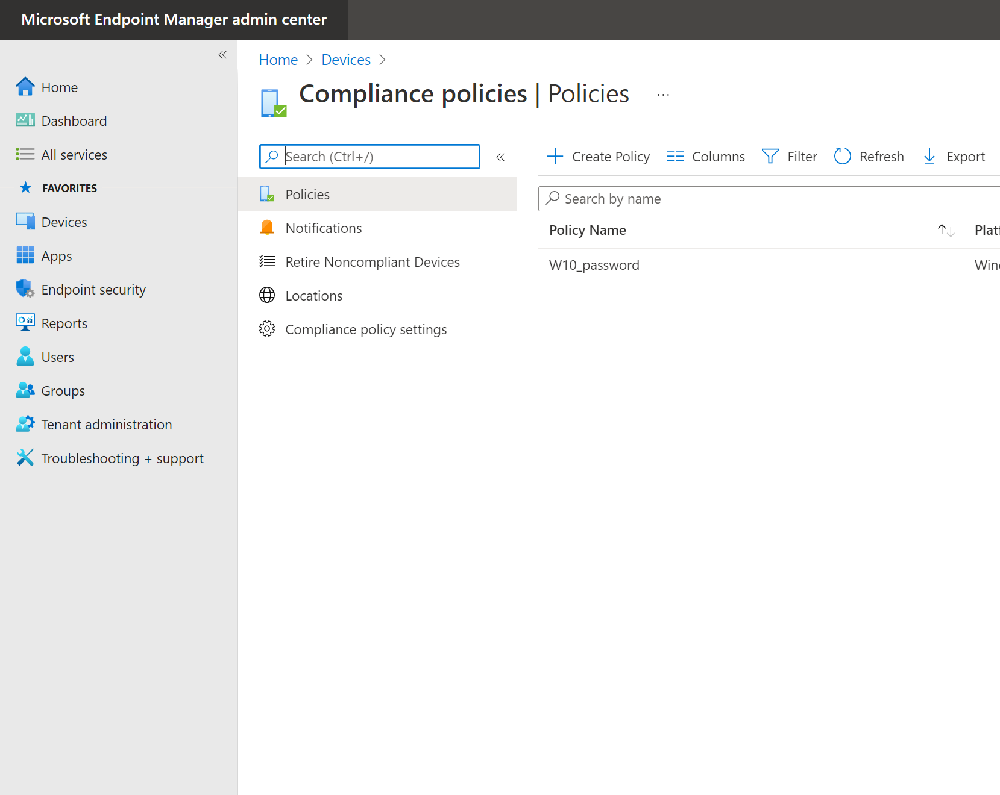
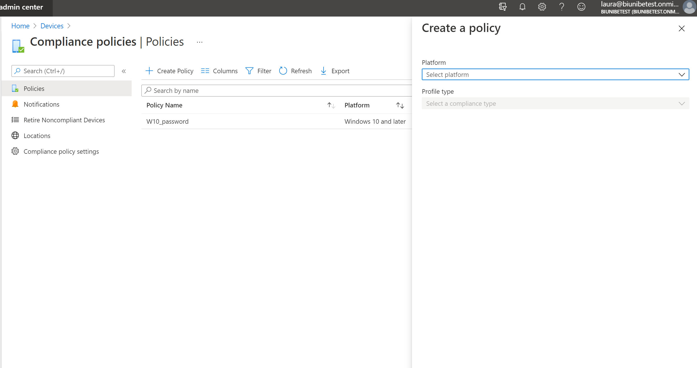
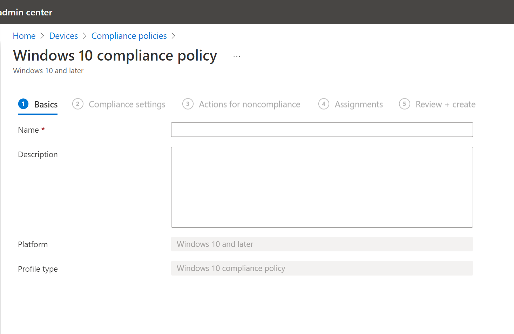
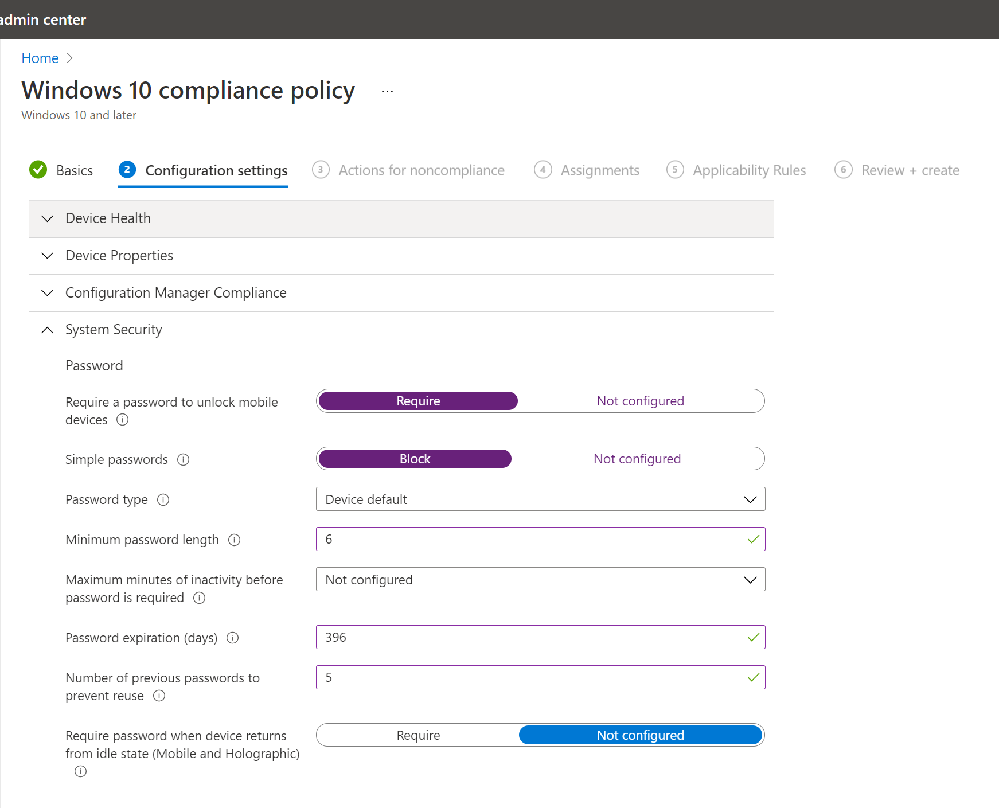
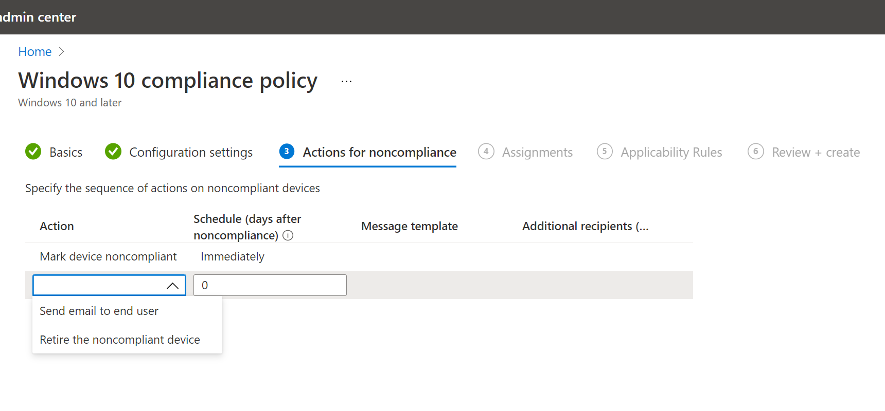
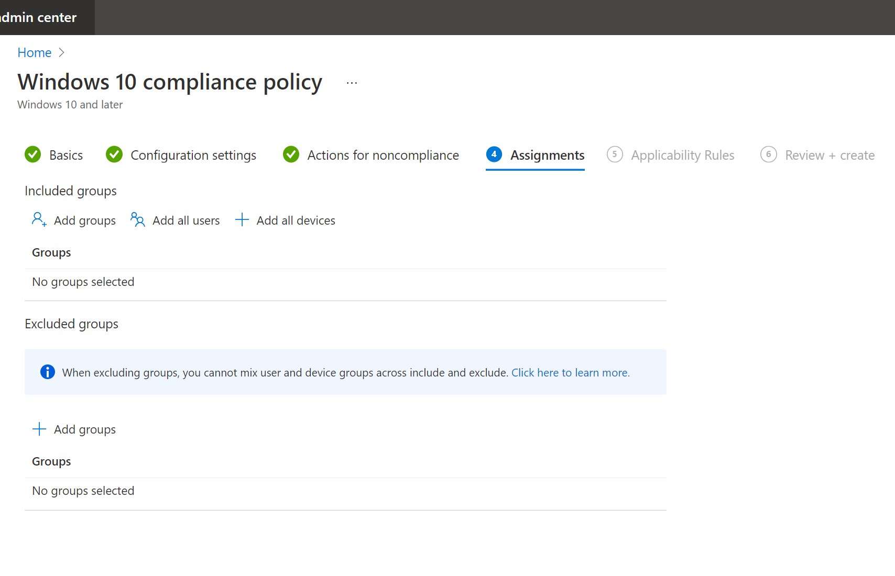
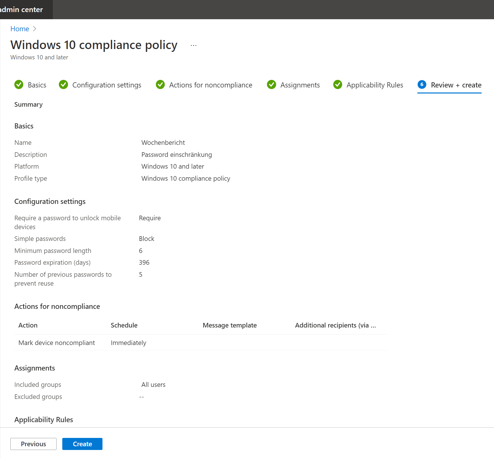

#Arbeitsheft

## Inhaltsverzeichnis

- [Intune](#Intune)

    * [Configuration profiles](#conf)

        * [Wallpaper](#wpaper)

        * [Lockscreen](#Lscreen)

        * [Start menu layout and taskbar](#SandT)

    * [Add Apps](#Apps)

        * [Default file associations](#FileAssoc)

    * [Toast notification](#toast)

    * [IE Mode](#IE)

    * [Password policy](#pwd)

    * [PIN Deaktivierung](#PIN)

    * [Gerät bei Autopilot hinzufügen](#Autopilot)

        * [Autopilot Script Anpassung](#AutoPilotScript)

- [Softwarepaketierung](#SoftPack)

- [KFM](#KFM)

- [Multiboot-USB-Stick](#YUMI)

    * [Boot Probleme](#YUMIboot)

- [Firmware Update](#FirmUp)

- [Bootcamp](#BootC)

---

## Intune

### Configuration profiles

#### Wallpaper

---

#### Lockscreen

---

#### Start menu layout and taskbar

---

### Add Apps

---

#### Default file associations

---

### Toast notification

---

### IE Mode

---

### Password policy

Um eine Password Policy zu setzten, navigiere zu **Start > Devices > Compliance policies**.

=== "Start"    

    

=== "Devices"

    

=== "Compliance policies"

    

Nun Create Policy anwählen.

!!! info
    Nun kann man damit beginnen die Password Policy zu erstellen, die kann man wie ich sie gemacht habe befolgen oder auch einige Dinge abändern.

**Konfigurationsschritte**

=== "Create a policy"    

    

=== "Basics"

    

    

=== "Configuration settings"    

    

    

    

    

=== "Actons for noncompliance"

    

=== "Assignments"

    

    

=== "Applicability Rules"

    

=== "Review + create"

    

---

### PIN Deaktivierung

{: style="height:450px"}

Nach diesem kurzen Schritt wird das "Windows Hello for Business" deaktiviert. Somit auch die Eingabe vom PIN, welche ich deaktivieren wollte.

**Arbeitsschritte**

1. Zuerst muss man vom Home aus zu **Devices > Windows > Windows enrollment** navigieren.

     

2. Unter **Windows enrollment** kann man nun **Windows Hello for Business** anklicken.

     

3. Auf dem neu erschienen Feld, muss man unter **Configure Windows Hello for Business** *Disabled* angeben.

     

4. Nun *Save* anwählen.

     

5. Nach der Speicherung wurde der PIN schon deaktiviert.

     

---

### Gerät bei Autopilot hinzufügen

Bevor man in Intune das Gerät importieren kann. Muss ein Script auf dem jeweiligen Gerät ausgeführt werden.

#### Auf dem Gerät

1. Wie auf [THE LAZY ADMINISTRATOR](https://www.thelazyadministrator.com/2020/01/27/get-a-new-computers-auto-pilot-hash-without-going-through-the-out-of-box-experience-oobe/) das Script herunterladen und am besten auf einem USB-Stick speichern, für weiteren gebrauch.

2. Nach dem Download fehlte bei mir noch ein CMD feil welches ich kopiert habe.

3. Nun kann das Get-WindowsAutoPilotInfo.ps1 ausgeführt werden. *Als Admin ausführen!*

4. Nun sollte eine compHas.csv erstanden sein, welche man für den Intune schritt braucht.

#### In Intune

1. Zuerst muss man vom Home aus zu **Devices > Windows > Windows enrollment > Devices** navigieren.

     

2. Auf der **Windows Autopilot devices** Seite *Import* anwählen.

     

3. Hier nun die erstellte compHash.csv angeben.

    === "Schritt 1"

        {: style="height:550px"}

    === "Schritt 2"

        

    === "Schritt 3"

        {: style="height:550px"}

4. Nach einigen Minuten sollte das Gerät neu auf der Liste erscheinen.

     

---

#### Autopilot Script Anpassung

Damit das Gerät welches mit Autopilot aufgesetzt wird, auch den Group Tag erhält und Online die neuste Windows Version herunterlädt. Muss man nur drei kleine Änderungen am Script vornehmen, welches im KW7 Wochenbericht erstellt habe.

**Arbeitsschritte**

1. Zum Starten Windows PowerShell ISE öffnen.

    

2. Nun die Script Datei auf dem USB-Stick öffnen.

    === "Schritt 1"

        Von der Startseite aus zu **Datei > Öffnen...** navigieren. Oder mit dem shortcut Strg + O.

        

    === "Schritt 2"

        Jetzt zur ps1. Datei navigieren und diese öffnen.

        

3. Nun die drei Änderungen vornehmen.

    === "Unverändert"

        

    === "Group Tag"

        Da ich möchte, dass jedes Gerät den Group Tag Client automatisch zugeordnet kriegt. Gebe ich dies unter $GroupTag an.
        Auf dem Bild wäre dies in der Zeile 117 zusehen.

        

    === "Online"

        Jetzt noch $Online auf $true stellen.
        Auf dem Bild wäre dies in der Zeile 123 zusehen.

        

    === "Assign"

        Assign habe ich zusätzlich auch noch auf $true gestellt.
        Auf dem Bild wäre dies in der Zeile 129 zusehen.

        

---

## Softwarepaketierung

---

## KFM

---

## Multiboot-USB-Stick mit YUMI erstellen

Mit dieser Anleitung kann man einen Multiboot-USB-Stick erstellen. Ich habe dafür YUMI („Your Universal Multiboot Installer“) verwendet und ein Windows 10, Windows 11 und Knoppix 9.1 gewählt.

### YUMI Download

1. Auf der [Pendrivelinux.com](https://www.pendrivelinux.com/yumi-multiboot-usb-creator/) findet man die drei YUMI Varianten, die man downloaden kann. Ich habe YUMI exFAT verwendet. Der direkte link für [YUMI exFAT](https://www.pendrivelinux.com/yumi-multiboot-usb-creator/#YUMI-exFAT).

    

2. Zum Downloaden, beim YUMI exFAT (BIOS and UEFI USB Boot) abschnitt bis nach unten scrollen und auf den Download Button klicken. Nach dem Download YUMI mit einem doppelklick starten.

### Multiboot-USB-Stick erste schritte

1. Nach dem Starten von YUMI muss man zuerst die Bedingungen mit «**I Agree**» bestätigen.

     

2. Nun unter **Step 1: ...** der gewünschte USB-Stick anwählen.

     

3. Jetzt bei **Step 2: ... die** Liste öffnen, in dem man ins leere Feld klickt und danach das passende zu Ihrem iso wählen. (Da ich ein Windows 11 iso auf dem Stick haben wollte, habe ich in der Liste Windows Installer iso ausgewählt)

    

4. Nun da der Explorer erschienen ist kann man zum iso File navigieren und dies anwählen. Wen man das richtige iso hat, **Öffnen** anwählen.

    

5. Jetzt kann man auf **Create** klicken.

    === "Create"    

        

    === "Kopierprozess"

        Der Kopierprozess dauert ca. 2 Minuten.

        

    === "Hinzufügung"

        Nachdem es fertig geladen hat, kann man auch **Next >** klicken.

        

    === "Nächstes ISO"

        Nun wird man danach gefragt, ob man ein weiteres iso auf den Stick laden möchte. Da auf einen Multiboot-USB-Stick mehrere gehören, habe ich **ja** angewählt.

        

### Weitere Images

Nach dem man Ja angewählt hat, erscheint das gleiche Feld wie zuvor. Jetzt kann man die gleichen Schritte wie zuvor durchspielen, bis man alle Images hat, die man möchte.

**Beispiel Knoppix:**

Bei Knoppix habe ich das gleiche wie bei Windows gemacht, nur dass ich bei **Step 2: ...** Ubuntu ausgewählt habe.

### Hinweise

- Sollte man zweimal das gleiche iso anwählen, wird man darauf aufmerksam gemacht.

  

- Bei mehreren ISOs erscheint ein **Step 4:...** welcher optional ist.

  

- Bei wieder Verwendung von YUMI kann man unter **Reinstall or Update?** nachschauen welche die aktuellste Version ist und welche Version auf dem Gerät installiert ist.

  

!!! warning
    Bei Hinzufügung von einem ISO auf einem USB-Stick kein Reinstall durchführen, sonst werden alle schon vorhandenen ISO's gelöscht.

---

### Probleme beim Booten

Möchte man von einem USB-Stick aus booten, bekommt aber die Meldung "" kann man wie folgt vorgehen.

---

## Firmware Update bei hp Drucker

1. **Drucker suchen**

    Unter **Print Management** nach dem Drucker suchen und Doppel klick auf den Druckernamen.

    

2. **Produktname suchen**

    Unter **General** wurde der Produktname bei dem Kommentar hinterlegt.

    

3. **Nach Software und Treiber von Produkt suchen**

    Auf der hp Seite den Produktnamen angeben. Wie auf dem Bild zu sehen reicht der markierter teil. [hp Link](https://support.hp.com/ch-de/drivers/printers)

    

4. **Nach Firmware suchen**

    Auf der neu erschienenen Seite nach Firmware suchen. Es kann kein oder mehrere Updates vorhanden sein. Bei einem passenden update auf **Herunterladen** klicken.

    

5. **exe Datei starten**

    Nach einigen Sekunden muss man unten **Run** anwählen.

    

6. **Drucker suche**

    Bei diesem Schritt des Prozesses sucht es nach Druckern, die zu dem heruntergeladenen Update passt.

    

7. **Drucker Auswahl**

    Da auf meiner Drucker liste, mehrere Drucker wahren, die dem gleichen Model entsprachen, bekam ich eine grössere Auswahl als nur der von mir gesuchte Drucker. 

    

8. **Password Eingabe**

    Nach dem Anwählen von dem Drucker, bei dem ich das Update machen möchte, muss ich noch ein Password eingeben.

    

9. **Update starten**

    Nun kann man unten **Update** anwählen. Nach der Installierung kann man alle Fenster schliessen.

    

---

## Windows 10 mit dem Boot Camp-Assistenten auf einem Mac installieren

### Voraussetzungen für die Installation von Windows 10 auf einem Mac

- MacBook von 2015 oder neuer
- MacBook Air von 2012 oder neuer
- MacBook Pro von 2012 oder neuer
- Mac mini von 2012 oder neuer

- iMac von 2012 oder neuer1
- iMac Pro (alle Modelle)
- Mac Pro von 2013 oder neuer

!!! warning Anforderung
    Mindestens 64 GB freien Speicherplatz auf dem Startvolume des Mac.

1. **Einstellung für "Sicheres Starten" prüfen**

    Vor der Installation von Windows sollte man die Einstellung auf "Volle Sicherheit" stellen. Nach der Installation von Windows kann man mit jeder Einstellung für "Sicheres Starten" von Windows aus starten.[Link zur Anleitung um sicheres Starten überprüfen.](https://support.apple.com/de-de/HT208198)

2. **Mit dem Boot Camp-Assistenten eine Windows-Partition erstellen**

    Vom Finder aus zu **Programme > Dienstprogramme > Boot Camp-Assistent** navigieren. Dort den Boot Camp-Assistent starten.

    

    - Wenn der Boot Camp-Assistent dazu auffordert, die Größe der Windows-Partition festzulegen, muss man die oben genante mind. grösse berücksichtigen.

    !!! warning Anforderung
        Die Partitionsgrösse kann später nicht mehr geändert werden.

3. **Windows-Partition (BOOTCAMP) formatieren**

    Nach der Ausführung des Boot Camp-Assistenten wird der Mac neu gestartet und kehrt zum Installationsprogramm zurück. Wenn man nach dem Installationsprogramm gefragt wird, wo Windows installiert werden soll, muss man die BOOTCAMP-Partition an wählen, und dan auf "Formatieren" klicken.

    !!! info
        In den meisten Fällen wird die richtige BOOTCAMP-Partition vom Installationsprogramm automatisch ausgewählt und formatiert.

4. **Windows installieren**

    Nun am besten alle externen Geräte, die während der Installation nicht benötigt werden trennen. Dann auf "Weiter" klicken. Folgend den Anweisungen auf dem Bildschirm folgen, um Windows zu installieren.

5. **Boot Camp-Installationsprogramm unter Windows verwenden**

    Nach Abschluss der Windows-Installation wird der Mac unter Windows gestartet und das Fenster "Willkommen beim Boot Camp-Installationsprogramm" geöffnet. Nach dem beflogen der Anweisungen auf dem Bildschirm, werden die Boot Camp- und Windows-Support-Software (Treiber)installiert. Sobald dies fertig ist, wird man dazu aufgefordert, den Computer neu zu starten.

### Wechsel zwischen Mac und Windows

Um zwischen den beiden zu wechseln, muss man bei einem Neustart, die Wahltaste (oder die Alt-Taste) ⌥ während des Startvorgangs gedrückt halten. [Link zur kurz Anleitung von Apple.](https://support.apple.com/de-de/HT208123)
