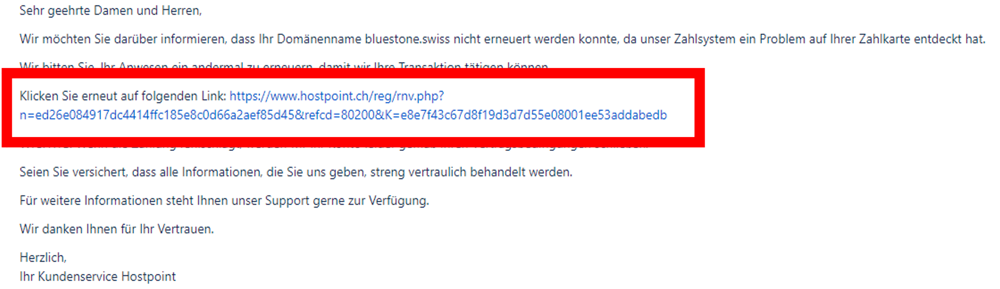
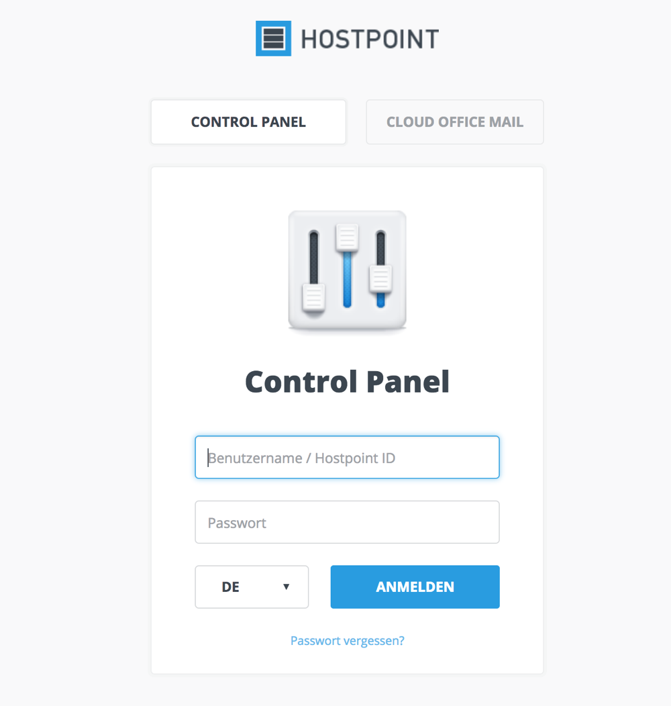
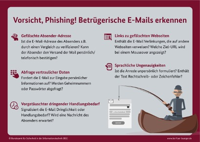

#Arbeitsheft

## Inhaltsverzeichnis

- [Phishing](#Phishing])

    * [Ablauf Phishing Attacke](#Phishing Attacke)

    * [Erkennung Phishing Mails](#Erkennung)

        * [Merkmale Phishing Mails](#Merkmale)

        * [Erkennung Phishing Mails](#Erkennung)

    * [Phishing Arten](#hishing Arten)

    * [Schutz gegen Phishing](#Schutz)

- [Schadsoftware](#Schadsoftware)

---

## Phishing

### Möglicher Ablauf einer Phishing Attacke

1. Eine offiziell wirkende E-Mail wird an eine möglichst grosse Anzahl von Nutzern gesendet.

    In der Mail werden hauptsächlich die Leser aufgefordert einen Link zu öffnen. Meistens enthält die Mail eine überzeugende Begründung für das Eintragen der Log-In Daten auf der meist gefälschter Webseite.

    Falls dem Angreifer eine E-Mail des Phishing-Ziels vorliegt, kann er deren Format kopieren. Auch einzelne Teile davon wie Begrüssung & Kontakt Angaben werden übernommen.

    !!! example ""
          <figure markdown>
            {: style="height:260px"}
            <figcaption>Beispiel Phishing Mail mit Link
          </figure>

2. Der Nutzer erreicht über den Link eine ebenfalls gefälschte Log-In-Seite. Oft orientieren sich die Angreifer an einer existierenden Seite.

    Sie kopieren das Layout und gestalten das Formular so, dass die Log-In-Daten in einer zugänglichen Datei gesammelt werden. Anschliessend erhält der Angreifer die Daten und den freien Zugriff auf den Account.

    !!! example ""
          <figure markdown>
            {: style="height:450px"}
            <figcaption>Beispiel Fake login Seite
          </figure>

### Erkennung Phishing Mails

#### Merkmale einer Phishing Mail

!!! warning "Grammatik- und Orthografie Fehler"

      Am einfachsten zu durchschauen sind E-Mails, die in fehlerhaftem Deutsch geschrieben sind. Solche Mails wurden meist nicht in Deutsch verfasst, sondern mit einem Übersetzungsdienst aus einer anderen Sprache übersetzt worden.

      Ein weiterer Hinweis auf solche E-Mails sind Zeichensatzfehler, wie etwas kyrillische Buchstaben oder auch fehlende Umlaute.

!!! warning "Mails in fremder Sprache"

      Ebenfalls ein weiterer Tipp um Phishing Mails zu erkennen sind E-Mails, die auf Englisch oder Französisch verfasst sind.

      Ist man nicht gerade ein Kunde einer Bank mit Sitz im Ausland, kann man sicher sein, dass die (wenn überhaupt) E-Mails von der Bank nur auf Deutsch kommen.

!!! warning "Fehlender Name"

      Die Bank und andere Geschäftspartner wie zum Beispiel Online Zahlungsdienste sprechen Ihre Kunden in E-Mails grundsätzlich mit Ihrem Namen an und niemals mit «Sehr geehrter Kunde» oder «Sehr geehrter Nutzer».

      Phishing Experts haben aber oftmals auch die Namen Ihrer ziel Person schon herausgefunden und schreiben Sie mit persönlicher Ansprache an, zum Beispiel «Sehr geehrte Frau Meier» oder «Sehr geehrter Herr Müller». Damit versuchen die Kriminelle, das E-Mail eine höhere Glaubwürdigkeit zu verleihen.

!!! warning "Dringender Handlungsbedarf"

      Im Fall das man via E-Mail aufgefordert wird, ganz dringend und innerhalb einer bestimmten (kurzen) Frist zu handeln, sollte man ebenfalls stutzig werden. Insbesondere, wenn diese Aufforderung mit einer Drohung verbunden ist beispielsweise, dass sonst Ihre Kreditkarte oder Ihr Online Zugang gesperrt werden.

!!! warning "Eingabe von Daten"

      Die Aufforderung, persönliche Daten sowie möglicherweise PIN oder TAN einzugeben ist, ein weiterer Hinweis. Banken und Online-Zahlungsdienste werden ihre Kunden um so etwas nicht per E-Mail bitten. PIN und TAN werden von Geldinstituten niemals telefonisch oder per E-Mail von Banken abgefragt; dies zählt zu den wesentlichen Sicherheitsregeln.

!!! warning "Aufforderung zur Öffnung einer Datei"

      In immer mehr Phishing-E-Mails werden die Empfänger aufgefordert, direkt an die E-Mail angehängte Dateien oder Dateien zu öffnen, die über einen Link heruntergeladen werden können.

      Solche Dateien dürfen niemals in unerwarteten E-Mails herunterladen oder geöffnet werden. Normalerweise enthält diese Datei bösartige Programme wie Viren oder Trojaner. Man sollte sich niemals von Drohungen wie Kontosperrung, Inkassoeingriff oder anderen fiktiven Gründen dazu verleiten lasen, den Anhang zu öffnen. Bei E-Mails mit einem Dateianhang sollte man grundsätzlich misstrauisch sein.

!!! warning "Mailheader"

      Manche Phishing-Mails sind ausgesprochen akzeptabel gemacht. Die Absender-E-Mailadresse scheint vertrauenswürdig, der Link im Text ebenfalls, das Deutsch ist flüssig? Trotzdem muss ebendiese E-Mail nicht authentisch sein.

      Gleichfalls Absenderangaben von E-Mails lassen sich fälschen. Um letzte Gewissensbisse auszuräumen, muss in der genannten E-Mail der Mail-Header angeschaut werden. Dort steht die IP-Adresse des Absenders. Nur ebendiese ist fälschungssicher und gibt Aufschluss über den tatsächlichen Absender.

#### Erkennung Phishing Mails Beispiele

- [x] Die Anrede ist sehr unpersönlich, ohne Ihren Namen zu nennen: "Sehr geehrter Kunde …".

- [x] Der Text der Mail gibt dringenden Handlungsbedarf vor, etwa: "Wenn Sie Ihre Daten nicht umgehend aktualisieren, dann gehen sie unwiederbringlich verloren …".

- [x] Drohungen kommen zum Einsatz: „Wenn Sie das nicht tun, müssen wir Ihr Konto leider sperren …".

- [x] Im Mail wird man aufgefordert, vertrauliche Daten wie die PIN für einen Online-Bankzugang oder eine Kreditkartennummer einzugeben.

- [x] Die E-Mail enthält komische Links oder Formulare.

- [x] Der Nachrichtentext ist in schlechtem Deutsch verfasst.

- [x] Der Text enthält kyrillische Buchstaben, falsch aufgelöste oder gänzlich fehlende Umlaute – zum Beispiel "ae" oder "ea" statt ä.

!!! example ""
      <figure markdown>
        {: style="height:400px"}
        <figcaption>Merkblatt Phishing von BSI Bund
      </figure>

### Phishing Arten

#### **Was ist Spear Phishing?**

Beim Angeln mit der Angelrute kann sich eine Reihe von verschiedenen Gegenständen unter der Wasseroberfläche finden wie zum Beispiel eine Flunder, eine Forelle oder ein Stück Abfall. Beim Fischen mit dem Speer gehen Sie gezielt auf einer Jagd nach einem bestimmten Fisch. Aus dem Grund kommt der Name «Spear Fishing» (Speerfischen).

Beim Spear Phishing wird eine bestimmte Gruppe oder eine Person mit einer bestimmten Funktion gesucht, z.B. der Systemadministrator eines Unternehmens.

---

#### **Was ist Whaling?**

Das Whaling ist eine noch gezieltere Art von Phishing, da es die Wale im Visier hat beziehungsweise die richtig grossen Fische.
Diese Angriffe zielen in der Regel auf den CEO, CFO oder ein anderes Mitglied der Geschäftsleistung eines bestimmten Unternehmens oder in einer Branche.

In einer Whaling E-Mail kann beispielsweise stehen, dass dem Unternehmen rechtliche Konsequenzen drohen und Sie auf den Link klicken müssen, um weitere Informationen zu erhalten.

Der Links leitet Sie auf eine Seite, auf der Sie gebeten werden, alle wichtigen Daten über das Unternehmen einzugeben, etwa wie die Steuer-ID und Nummern von Bankkonten.

---

#### **Was ist Smishing?**

Das Smishing ist ein Angriff, für den Text oder Kurznachrichten sprich (SMS) verwendet werden. Eine gängige Smishing Technik besteht darin, per SMS eine Nachricht an ein Mobiltelefon zu senden, welches ein anklickbaren Link oder eine Rückrufnummer enthält.

Ein beliebtes Beispiel für ein Smishing Angrif ist eine SMS Nachricht, welches so aussieht, als käme sie von Ihrer Bank.

Der Angreifer fordert einen auf, Ihre Kontonummer, Sozialversicherungsnummer, Ausweisnummer usw. zu verifizieren. Sobald der Angreifer die Informationen erhält, hat er die Kontrolle über das Bankkonto.

---

#### **Was ist Vishing?**

Vishing dient demselben Zweck wie andere Arten von Phishing-Angriffen. Den Angreifern geht es auch hier um vertraulichen persönlichen Daten oder Unternehmensinformationen. Dieser Angriff erfolgt über einen Telefonanaruf. Daher das «V» (vom englischen «Voice») anstelle des «Ph» im Namen.

Ein häufiger Vishing-Angriff besteht darin, dass sich eine Person bei einem Anruf als Vertreter von Microsoft ausgibt. Diese Person teilt Ihnen mit, dass sie Malware auf Ihrem Computer entdeckt hat. Sie werden dann aufgefordert, Ihre Kreditkartendaten anzugeben, damit der Angreifer eine aktualisierte Version der Antiviren-Software auf Ihrem Computer installieren kann. Der Angreifer hat nun Ihre Kreditkartendaten, und mit hoher Wahrscheinlichkeit haben Sie Malware auf Ihrem Computer installiert.

Diese könnte alles enthalten, von einem Banking-Trojaner bis hin zu einem Bot (kurz für „Robot“). Der Banking-Trojaner beobachtet alle Onlineaktivitäten, um weitere Daten zu stehlen – oft die Daten des Bankkontos einschließlich des Passworts.

Ein Bot ist eine Software, die so konzipiert ist, dass sie die vom Hacker gewünschten Aufgaben erfüllt. Er wird per Command and Control (C&C) gesteuert, um Bitcoins zu schürfen, Spam zu versenden oder einen Angriff im Rahmen eines Distributed Denial of Service (DDoS) zu starten.

---

#### **Was ist E-Mail Phishing?**

Das E-Mail Phishing ist die häufigste Art von Phishing und kommt seit 1990er Jahren zum Einsatz. Die Täter versenden E-Mails an alle möglichen E-Mail-Adressen, die Sie in die Hände bekommen. In der Regeln wird im E-Mail mitgeteilt, dass Ihr Konto gefährdet ist und Sie sofort reagieren müssen, indem Sie auf den angegebenen Link klicken.

Einige E-Mails sind nur schwer als Phishing Angriffe zu erkennen, vor allem wenn die Sprache und Grammatik sorgfältig gestaltet sind. Das Überprüfen des Absenders der E-Mail und des Links, den Sie anklicken sollen, auf verdächtige Formulierungen kann Ihren Aufschluss darüber geben, ob die Quelle verdächtig ist.

Ein weiterer Phishing-Scam, den man als Sextortion (aus den englischen Worten „Sex“ und „Extortion“, also Erpressung) bezeichnet, erfolgt, wenn ein Hacker eine E-Mail sendet, die scheinbar von Ihnen selbst gesendet wurde. Der Hacker behauptet, Zugang zum E-Mail-Konto und Computer zu haben. Er behauptet weiterhin, das Passwort und ein aufgezeichnetes Video von dem Opfer zu besitzen.

Der Hacker behauptet, Videos mit nicht jugendfreiem Inhalt vom Opfer vom persönlichen Computer aus gesehen zu haben, während die Kamera eingeschaltet war und sie aufgezeichnet hat. Der Hacker verlangt eine Bezahlung meist in Bitcoin. Andernfalls würde er das Video an Familie und/oder Kollegen weitergeben.

---

#### **Was ist Suchmaschinen-Phishing?**

Beim Suchmaschinen-Phishing, auch bekannt als SEO-Poisoning oder SEO-Trojaner, versuchen Hacker, bei einer Suche über eine Suchmaschine auf die erste Position der Trefferliste zu gelangen. Wenn Sie auf den in der Suchmaschine angezeigten Link klicken, wird man auf die Website des Hackers weitergeleitet.

Von dort aus können Betrüger Informationen stehlen, wenn man auf der Internetseite aktiv ist und/oder vertrauliche Daten eingeben. Websites von Hackern können sich als jede beliebige andere ausgeben, aber die Hauptkandidaten sind Banken, Geldtransferdienste, Social-Media-Seiten und Onlineshops.

### Wie schützt man sich gegen Phishing?

- **Überprüfe stets die Adressleiste in deinem Browser.** Am besten tragst du die Adressen zu häufig besuchten Login-Seiten in die Favoritenliste des Browsers ein.

- **Klicken niemals auf Links in einer dubiosen E-Mail.** Versuche im Zweifelsfall stattdessen, die im E-Mail-Text genannte Seite über die Startseite der betreffenden Organisation zu erreichen – also ohne den angegebenen Link in die Adresszeile des Browsers einzutippen.

- **Gebe keinesfalls persönliche Daten wie Passwörter, Kreditkarten- oder Transaktionsnummern via E-Mail preis** – egal, wie vertrauenserweckend die betreffende E-Mail erscheint.

- **Gebe persönliche Informationen nur in der gewohnten Weise etwa auf der Online-Banking-Website ein.** Sobald irgendetwas seltsam vorkommt, beende die Verbindung sofort und kontaktiere den regulären Website-Betreiber.

- **Öffne niemals Dateien im Anhang einer verdächtigen E-Mail.**

- **Beende jede Online-Session durch den regulären Log-out** – statt einfach nur das Browserfenster zu schließen.

- **Gebe niemals persönliche Daten auf Webseiten mit unverschlüsselter Verbindung ein.** Ob eine Website verschlüsselt mit Ihrem Browser kommuniziert, erkennen man an der Abkürzung "https://" in der Adresszeile sowie an dem kleinen Vorhängeschloss- Symbol neben der Adresszeile des Browsers.

- Achte stets darauf, dass Ihre **Antivirus-Software aktuell und die Firewall aktiv ist.**

!!! info "Info"
          Solltest man  ein Wichtiges Mail erhalten, welches ein wenig Merkwürdig ist, kann man immer über eine andere Art Kontakt aufnehmen. Zum Beispiel dem Absender Anrufen (Wichtig!  Ist das man die Telefonnummer von der Originalwebseite nimmt und keine hinterlegte Nummer im Mail).

## Schadsoftware

###**Definition Malware**

"Malware" wird als Oberbegriff für bösartige Software benutzt. Wie die unten aufgelisteten Schadsoftware.

###**Virus**

Ein Virus ist ein Programm, welches dazu entwickelt wurde, um Daten auf dem Computer zu beschädigen bzw. zu ändern. Ein Virus kann sich replizieren, des halb ist die schnelle Reaktion wichtig.

Vieren können sich in Anhang von Bildern, Audio/Videodateien oder kostenloser Software verbergen. Ein wichtiger Punkt ist, dass sich ein Virus nicht ohne menschliches Zutun verbreiten kann. Das bedeutet, dass sich ein Virus auf einem Gerät befinden kann, aber ohne die Ausführung oder Öffnung des bösartigen Programms das Gerät noch nicht infiziert ist.

---

###**Wurm**

Ein Wurm repliziert sich selbst, wie auch ein Virus. Der Unterschied, liegt darin, dass ein Wurm keine Dateien verändert oder löscht. Aber anders als ein Virus muss sich ein Wurm nicht an einem vorhandenen Programm anhängen. Sondern verbreitet sich, indem er Sicherheitslücken in Betriebssystemen ausnutzen.

Dadurch dass das bösartige Programm unzählige Kopien von sich selbst auf der lokalen Festplatte, auf der Netzwerkfreigabe usw. mach, hat das zu Folge, dass der Computer langsamer wird. Dies da durch das der Wurm sehr viel Festplattenspeicher belegt und einen grossen Anteil der CPU verbraucht.

---

###**Trojaner**

Ein Trojaner, auch trojanisches Pferd genannt ist ein Programm, welches vorgibt etwas zu machen, was im Hintergrund herausstellt, dass er etwas anderes macht. Die Programme, die installiert werden, sind meistens Malware. Ein Trojaner ist kein Virus, da er sich nicht selbst replizieren kann. Aber die schädlichen Programme, die durch ihn unbemerkt auf ein Gerät installiert wurden, können gleich grossen Schaden anrichte.

---

###**Ransomware**

Ransomware (von englisch ransom für „Lösegeld“), auch Erpressungstrojaner oder Erpressungssoftware genannt, ist ein Schadprogramm, bei dem Täter ihre Opfer mit Lösegeld erpressen. Dafür verschlüsseln sie empfindliche Daten oder sperren den Computer und machen meistens mit einer Popup Nachricht deutlich, dass dies nur mit einer Lösegeldzahlung widere freigegeben wird.

---

###**Keylogger**

Keylogger (in Deutsch Tasten-Rekorder) ist ein Softwareprogramm, welches die Tastatureingaben eines Rechners oder auch User protokollieren können. Bei einer solchen Überwachung kann man zu Passwörtern gelangen wie auch vertrauliche Daten.
Ein Keylogger gibt es nicht nur aus Software sondern auch aus Hardware.
Dialer:

---

###**Spyware**

Spyware in Deutsch Spionage- oder Schnüffelsoftware genannt, wird wie der Name schon sagt zum Ausspionieren und Aufzeichnen von Aktivitäten am Computer gebraucht. Dies ohne das Wissen oder Zustimmung der jeweiligen Person.

---

###**Adware**

Adware, auch bekannt als werbe gestützte Software, generiert Werbung auf dem Bildschirm, welches meist in einem Webbrowser einblendet wird. Adware wird in der Regel für Computer entwickelt, kann aber auch auf mobilen Geräten zu finden sein. Einige Formen von Adware sind sehr manipulativ und öffnen Türen für bösartige Programme.

Die unerwünschten (und sehr oft auch lästige) Popup-Werbung auf dem Computer oder Mobilgerät kommen in der Regel auf zwei Arten auf das Gerät:

Eine mögliche weise ist durch kostenloses Computerprogramme oder  Apps,  ohne unbedingt zu wissen, dass es  zusätzliche Software enthält, die Adware enthält.

Oder eine andere Möglichkeit ist, dass es eine Sicherheitslücke in der Software oder im  Betriebssystem gibt, die Hacker nutzen dies aus um Malware, einschliesslich einiger Arten von Adware, ins System einzuschleusen.

---

###**Rogue Security Software**

Rouge Security Software ist eine Art von Malware, welche dafür entwickelt wurde, Ihre Opfer davon zu überzeugen, dass Ihr Gerät von einem Virus befallen ist.
Wie es eigentlich ein echtes Antivirus Programm auch machen würde. Mit einer Pop-up Nachricht teilt es dem Benutzer mit, dass Ihr Computer infiziert wurde. Obwohl dies nicht der Fall ist!

Aber im Gegensatz zu einigen anderen Schadprogramme stiehlt, verändert, löscht oder verschlüsselt es keine Daten. Stattdessen geht es darum, dass das Opfer für eine Entfernung von einem nicht vorhandenen Virus zahlt.

---

###**Rootkit**

Wie nach "root" im Namen dringen Rootkits tief ins Betriebssystem ein und werden von dort aus aktiv. Das Wort „root“ bezieht sich auf die Root-Rechte, die auch den Namen Superuser-Konto haben. Dieses Konto wird bei der Installation eines Betriebssystems angelegt und gewährt dem User allgemeine Zugriffsrechte. Das „kit“ steht für eine Sammlung von Softwarewerkzeuge. Wörtlich übersetzt ist ein Rootkit also so etwas wie ein Werkzeugkasten für Administratoren.

Die eigentliche Gefahr geht auch nie vom Rootkit selber aus, sondern von der Malware dessen Spuren es verwischt. Dementsprechend liegt seine eigentliche Aufgabe darin, Schadprogramme von Virenscanner und sonstiges zu verstecken.
