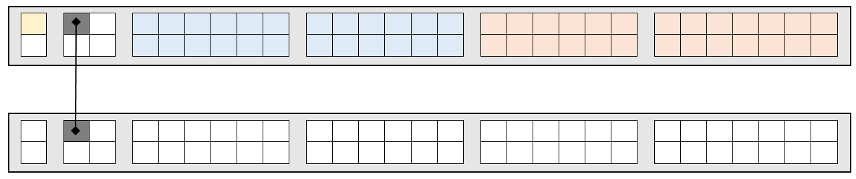
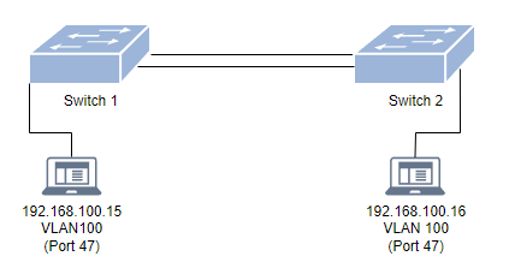

## 6. Praktische Arbeiten und Erfahrungen

### 6.1 Beschriftungssystem

Damit ich mir die Namensgebung merken kann werde ich unten ein Beispiel einer Beschriftung hinschreiben. Die Namensgebung ist nicht bei jeder Firma gleich meistens wird ein Konzept erstellt und dann wird dies auch angewendet.

**Beispiel:**	H6-W-V20.03-A10-10.038

=== "Aufteilung der Beschriftung und die Bedeutung"
    - H6 = Standort/Strasse

    - W	=	Ausrichtung

    - V	=	Verteiler

    - 20 = Stockwerk (Die Stockwerke gehen vom EG welches 00 ist in 10 Schritten aufwärts und   XXXXX  und ins UG gehen sie in
      einer schritten. Wie auf der Abbildung x)

    - 03 = Anzahl Verteiler/ Nr. des Verteilers

    - A10	=	Panel

    - 10 = Dose im Stockwerk

    - 038	=	Nr. der Dose

    - A	=	Das A gibt an, dass es um Kupferkabel handelt, wäre es ein Glasfaserkabel wird es mit //ABCD.L01, L02 oder L03 beschriftet.

=== "Auflösung des Beispiels"
    - H6 = Hochschulstrasse 6

    - W	=	Westen

    - V	=	Verteiler

    - 20 = 2 OG

    - 03 = Verteiler 3

    - A10	=	Panel

    - 10	=	Dose im 1 OG

    - 038 = Dosen Nummer 38

### 6.2 VLAN

Virtual Local Area Networks (VLAN) unterteilen ein bestehendes einzelnes physisches Netzwerk in mehrere logischen Netzwerke.
Untagged bedeutet, dass der komplette Port dem VLAN angehört.
Egal welches Gerät angeschlossen wird, wird automatisch im definierten VLAN landen. Untaggen macht man bei Ports die zu Endgeräten führen, da diese in der Regel tags nicht lesen können.

Tagged bedeutet, dass sich das Gerät mit dem VLAN tag melden muss, um in dem VLAN zu landen.
Damit können dann die Ports getagged werden über diese mehrere verschiedene VLAN’s gehen müssen. Damit kann man bis zu 4096 verschiedene braucht.

#### Start Aufgabe

=== "Ausgangslage"

    

    *Switch 1:*
    

    *Switch 2*
    

=== "Sollzustand"

    

    

???+ example "Arbeitsschritte"
     *Verbinden über Tera Term bei Switch 1:*

     **enable =** Anmeldung

     **show running-config =** zeigt die momentanen Konfigurationen an

     **erase startup-config =** löscht die momentanen Konfigurationen

     **reload =** startet den Switch neu

     **enable =** Anmeldung

     **conf t =** wechselt in den config Modus

     **vlan 100 name user =** erstellt das vlan 100 mit dem Namen user

     **untagged ethernet 1/1/1 to 1/1/24 =** untagged die Ports 1 bis 24

     **exit =** verlässt den (config-vlan-100) und geht in den config Modus

???+ abstract "Zwischenzustand"
     

     

???+ example "Arbeitsschritte"
     **vlan 200 name admin =** erstellt das vlan 200 mit dem Namen admin

     **untagged ethernet 1/1/25 to 1/1/48 =** untagged die Ports 25 bis 48

     **exit =** verlässt den (config-vlan-200) und geht in den config Modus

     **show running-config =** zeigt die momentanen Konfigurationen an

     **write me =** speichert die momentane Konfiguration

     **exit =** verlässt den config Modus

???+ abstract "Zwischenzustand"
     

     

     *Nun die gleichen Konfigurationen bei Switch 2 vornehmen. Danach das Gerät mit der IP 192.168.100.15 an Switch 1, Port 5 anhängen und Gerät mit der IP 192.168.100.16 an Switch 2, Port 11.*

???+ success "Test 1"
     **Stand:**

     

     

     **Soll:** Client 1 (IP 192.186.100.15) ist am Switch 1, VLAN 100, Port 5 angeschlossen und pingt erfolgreich Client 2. Client 2 (IP 192.186.100.16) ist am Switch 2, VLAN 100, Port 11 angeschlossen und pingt erfolgreich Client 1.

     **Ist:** Bei beiden Clients war der Zielhost nicht erreichbar.

     **Warum:** Weil bei beiden Ports über die die zwei Switches verbunden sind keine tags gemacht wurden.

     **Muss:**

     

     *Info: Damit dieser Test erfolgreich durchgeführt werden kann würde es reichen VLAN 100 zu taggen aber da VLAN 200 später auch gebraucht wird ist es im Muss schon vorhanden.*

#### **Arbeitsschritte um Fehler bei Test 1 zu beheben und IP Adresse zu setzen:**

???+ example "Arbeitsschritte"
     *Verbinden über Tera Term bei Switch 1:*

     **enable =** Anmeldung

     **show running-config =** zeigt die momentanen Konfigurationen an

     **conf t =** wechselt in den config Modus

     **ip address 192.168.1.10 255.255.255.0 dynamic =** setzt die IP-Adresse

     **show running-config =** zeigt die momentanen Konfigurationen an

     **write me =** speichert die momentane Konfiguration

???+ abstract "Zwischenzustand"
     

???+ example "Arbeitsschritte"
     **vlan 100 =** wechselt vom config Modus in den config-vlan-100

     **tagged ethernet 1/2/1 =** Tagged am angegebenen Port

     **exit =** verlässt den (config-vlan-100) und geht in den config Modus

     **vlan 200 =** wechselt vom config Modus in den config-vlan-200

     **tagged ethernet 1/2/1 =** Tagged am angegebenen Port

     **managment-vlan =** setzt den managment Status

     **exit =** verlässt den (config-vlan-200) und geht in den config Modus

     **write me =** speichert die momentanen Konfiguration

     **exit =** verlässt den config Modus

???+ abstract "Zwischenzustand"
     

???+ example "Arbeitsschritte"
     *Verbinden über Tera Term bei Switch 1:*

     **enable =** Anmeldung

     **show running-config =** zeigt die momentanen Konfigurationen an

     **conf t =** wechselt in den config Modus

     **ip address 192.168.1.20 255.255.255.0 dynamic =** setzt die IP Adresse

     **show running-config =** zeigt die momentanen Konfigurationen an

     **write me =** speichert die momentane Konfiguration

???+ abstract "Zwischenzustand"
     

???+ example "Arbeitsschritte"
     **vlan 100 =** wechselt vom config Modus in den config-vlan-100

     **tagged ethernet 1/2/1 =** Tagged am angegebenen Port

     **exit =** verlässt den (config-vlan-100) und geht in den config Modus

     **vlan 200 =** wechselt vom config Modus in den config-vlan-200

     **tagged ethernet 1/2/1 =** Tagged am angegebenen Port

     **managment-vlan =** setzt den managment Status

     **exit =** verlässt den (config-vlan-200) und geht in den config Modus

     **write me =** speichert die momentanen Konfiguration

     **exit =** verlässt den config Modus

???+ abstract "Zwischenzustand"
     

???+ success "Test 2"
     **Stand:**

     
     

     **Soll:** Client 1 (IP 192.186.100.15) ist am Switch 1, VLAN 100, Port 5 angeschlossen und pingt erfolgreich Client 2. Client 2 (IP 192.186.100.16) ist am Switch 2, VLAN 100, Port 11 angeschlossen und Ppngt erfolgreich Client 1.

     **Ist:** Pings wurden erfolgreich übertragen.

     **Warum:** Da wir die zwei Ports getaged haben.

#### **Arbeitsschritte um ein VLAN hinzuzufügen:**

=== "Ausgangslage"

    

    

=== "Sollzustand"

    

    

???+ example "Arbeitsschritte"
     *Verbinden über Tera Term bei Switch 1:*

     **enable =** Anmeldung

     **conf t =** Wechselt in den config Modus

     **vlan 300 name user_mobile =** Erstellt das vlan 300 mit dem Namen user_mobile

     **exit =** Verlässt den (config-vlan-300) und geht in den config Modus

     **vlan 200 =** Wechselt vom config Modus in den config-vlan-200

     **no untagged ethernet 1/1/25 to 1/1/47 =** Macht das untaggen von Port 25 bis 47 rückgängig und lässt somit Port 48 als einziger untagged

     **exit =** Verlässt den (config-vlan-200) und geht in den config Modus

???+ abstract "Zwischenzustand"
     

     

???+ example "Arbeitsschritte"
     **vlan 300 =** Wechselt vom config Modus in den config-vlan-300

     **untagged ethernet 1/1/25 to 1/1/47 =** untagged die Ports 25 bis 47

     **exit =** Verlässt den (config-vlan-300) und geht in den config Modus

     **show running-config =** Zeigt die momentanen Konfigurationen an

     **write me =** Speichert die momentanen Konfiguration

     **exit =** Verlässt den config Modus

???+ abstract "Zwischenzustand"
     

     

     *Nun die gleichen Konfigurationen bei Switch 2 vornehmen. Danach das Gerät mit der IP 192.168.100.15 an Switch 1, Port 48 anhängen und Gerät mit der Ip 192.168.100.16 an Switch 2, Port 48.*

???+ success "Test 3"
     **Stand:**

     

     

     **Soll:** Client 1 (IP 192.186.100.15) ist am Switch 1, VLAN 200, Port 48 angeschlossen und Pingt erfolgreich Client 2. Client 2 (IP 192.186.100.16) ist am Switch 2, VLAN 200, Port 48 angeschlossen und Pingt erfolgreich Client 1.

     **Ist:** Ping’s wurden erfolgreich übertragen.

     **Warum:**

???+ success "Test 4"
     *Vor dem Test muss Client 1 (IP 192.186.100.15) auf Switch 1, VLAN 300, Port 25 umgesteckt werden und Client 2 (IP 192.186.100.16) auf Switch 2, VLAN 300, Port 47.*

     **Stand:**

     

     

     **Soll:** Client 1 (IP 192.186.100.15) ist am Switch 1, VLAN 300, Port 25 angeschlossen und Pingt erfolgreich Client 2. Client 2 (IP 192.186.100.16) ist am Switch 2, VLAN 300, Port 47 angeschlossen und Pingt erfolgreich Client 1.

     **Ist:** Das Ping kann bei beiden nicht ausgeführt werden.

     **Warum:** Weil bei beiden Ports über die die zwei Switches verbunden sind keine tags gemacht wurden für das VLAN 300.

     **Muss:**

     

#### **Arbeitsschritte um Fehler bei Test 4 zu beheben:**

???+ example "Arbeitsschritte"
     *Verbinden über Tera Term bei Switch 1:*

     **enable =** Anmeldung

     **conf t =** Wechselt in den config Modus

     **vlan 300 =** Wechselt vom config Modus in den config-vlan-300

     **tagged ethernet 1/2/1 =** Tagged am angegebenen Port

     **exit =** Verlässt den (config-vlan-300) und geht in den config Modus

     **show running-config =** Zeigt die momentanen Konfigurationen an

     **write me =** Speichert die momentanen Konfiguration

     **exit =** Verlässt den config Modus

     *Nun die gleichen Konfigurationen bei Switch 2 vornehmen.*

???+ abstract "Zwischenzustand"
     

???+ success "Test 5"
     **Stand:**

     

     

     **Soll:** Client 1 (IP 192.186.100.15) ist am Switch 1, VLAN 300, Port 25 angeschlossen und Pingt erfolgreich Client 2. Client 2 (IP 192.186.100.16) ist am Switch 2, VLAN 300, Port 47 angeschlossen und Pingt erfolgreich Client 1.

     **Ist:** Ping’s wurden erfolgreich übertragen.

     **Warum:** Da Ich die zwei Port’s getaged haben.

### 6.3 Link Aggregation

=== "Ausgangslage"

    

=== "Sollzustand"

    

???+ example "Arbeitsschritte"
     *Verbinden über Tera Term bei Switch 1:*

     **enable =** Anmeldung

     **conf t =** Wechselt in den config Modus

     **lag switch_to_switch dynamic id 1 =** Erstellung eines LAG (namen switch_to_switch, dynamisch, id 1)

     **ports ethernet 1/2/1 to 1/2/2 =** Fügt die angegebenen Ports dem LAG hinzu

     **primary-port 1/2/1 =** Setzt den angegebenen Port als Primary Port

     **deploy =** Schaltet dies ein

     **write me =** Speichert die momentanen Konfiguration

     **exit =** Verlässt den (config-lag switch_to_switch dynamic id 1) und geht in den config Modus

     **show running-config =** Zeigt die momentanen Konfigurationen an

???+ abstract "Ausgabe"
     

!!! warning "Info"
    Nun muss man noch auf dem VLAN 100 den primary port taggen. Wichtig! Das taggen kann erst nach dem deploy machen ansonsten kommt beim deployen ein Error.

    Nun die gleichen Konfigurationen bei Switch 2 vornehmen.

???+ example "Arbeitsschritte"
     Jetzt bei beiden Switches noch den Primary Port taggen:

     **vlan 100 =** Wechselt vom config Modus in den config-vlan-100

     **tagged ethernet 1/2/1 =** Tagged am angegebenen Port

     **write me =** Speichert die momentanen Konfiguration

     **exit =** Verlässt den (config-vlan-100) und geht in den config Modus

     **show running-config =** Zeigt die momentanen Konfigurationen an

???+ abstract "Ausgabe"
     

???+ success "Test 1"
     **Stand:**

     

     **Soll:** Client 1 (IP 192.186.100.15) ist am Switch 1, VLAN 100, Port 47 angeschlossen und Pingt erfolgreich Client 2. Client 2 (IP 192.186.100.16) ist am Switch 2, VLAN 100, Port 47 angeschlossen und Pingt erfolgreich Client 1. Beim ausstecken vom Kabel am Port 1/2/1 an Switch 1 wird das Ping erfolgreich weitergeführt.

     **Ist:** Pings wurden erfolgreich übertragen. Nach einem kurzen unter Bruch beim ausstecken des Kabels wurde das Ping wieder erfolgreich ausgeführt.

     **Warum:** Dank dem Link Aggregation lief das ping dann über den 1/2/2 Port.

### 6.4 Subnetting Aufgaben

*Aufgabe 1*

=== "Ausgangslage"

    Adressvorgabe: 172.17.196.0/21

    Netzadresse:

    Broadcastadresse:

    Gatewayadresse (Erste Hostadresse):

    Anzahl mögliche Hosts:

    Um welche Adressart handelt es sich bei 172.17.196.0/21:

    Netz / Host / Broadcast / Gateway

=== "Lösung"

    Netzadresse: 172.17.192.0/21

    Broadcastadresse: 172.17.199.255

    Gatewayadresse (Erste Hostadresse): 172.17.192.1

    Anzahl mögliche Hosts: 2048 -2

    Um welche Adressart handelt es sich bei 172.17.196.0/21:

    Netz / **Host** / Broadcast / Gateway

*Aufgabe 2*

=== "Ausgangslage"

    Adressvorgabe: 10.128.31.159/27

    Netzadresse:

    Broadcastadresse:

    Gatewayadresse (Erste Hostadresse):

    Anzahl mögliche Hosts:

    Um welche Adressart handelt es sich bei 10.128.31.159/27:

    Netz / Host / Broadcast / Gateway

=== "Lösung"

    Netzadresse: 10.128.31.128

    Broadcastadresse: 10.128.31.159

    Gatewayadresse (Erste Hostadresse): 10.128.31.129

    Anzahl mögliche Hosts: 32 -2

    Um welche Adressart handelt es sich bei 10.128.31.159/27:

    Netz / Host / **Broadcast** / Gateway
