## Inhaltsverzeichnis

- [ISO/OSI-Referenzmodell](#1)

    * [OSI-Modell](#1.2)

- [OSI- und TCP/IP Tabelle](#2)

- [Layer 1 Bitübertragung(Physical)](#3)

    * [Twisted Pair Kabel (UPT / FTP / STP)](#3.1)

        * [UPD](#3.1.1)

        * [STP](#3.1.2)

        * [S/UTP](#3.1.3)

        * [S/FTP](#3.1.4)

    * [RJ45 Stecker](#3.2)

    * [RJ45 Stecker Belegung](#3.3)

    * [Lichtwellenleiter](#3.4)

        * [Fasertypen](#3.4.1)

        * [Tabellen Übersicht Fasertypen](#3.4.2)

        * [MM Faserklassen (GbE)](#3.4.3)

    * [LWL-Stecker](#3.5)

        * [SC-Stecker](#3.5.1)

        * [LC-Stecker](#3.5.2)

        * [MTP-Stecker](#3.5.3)

        * [Übersicht verschiedener Stecker](#3.5.4)

    * [Fiber connector](#3.6)

- [Layer 2 Sicherung (Data Link)](#4)

    * [Ethernet](#4.1)

    * [Zugriffsverfahren](#4.2)

    * [Kollisionen](#4.3)

    * [Frame](#4.4)

        * [Frame Bausteine](#4.4.1)

        * [Ethernet-Pakete Struktur](#4.4.2)

    * [Tag im Ethernet Frame](#4.5)

    * [Link Aggregation](#4.6)

- [Layer 3 Vermittlung (Network)](#5)

    * [IPv4-Adressierung](#5.1)

    * [Aufbau einer IPv4-Adresse](#5.1.1)

        * [Struktur im IPv4-Adressraum](#5.1.2)

    * [Spezielle und private Adress-Bereiche](#5.2)

    * [Reservierte und nicht verfügbare IPv4-Adressen/Subnetze](#5.3)

    * [Umrechnung](#5.4)

    * [Übersicht Standards](#5.5)

    * [Subnetting](#5.6)

        * [Subnetzmaske](#5.6.1)

        * [Netzwerkadresse berechnen](#5.6.2)

- [6. Praktische Arbeiten und Erfahrungen](#6)

    * [Beschriftungssystem](#6.1)

    * [VLAN](#6.2)

    * [Link Aggregation](#6.3)

    * [Subnetting Aufgaben](#6.4)

---

## 1. ISO/OSI-Referenzmodell

Damit Daten ausgetauscht werden können, gibt es einen bestimmten Ablauf, der den Austausch möglich macht. Und dies ist im OSI-Modell, welches ein Schichten Modell ist, grafisch aufgezeigt. So kann man sich dann ungefähr vorstellen, wie der Ablauf in Realität abläuft. Es hilft grundsätzlich, das netzwerktechnische Sachverhalte besser zu verstehen, natürlich gibt es ab und zu einige Abweichungen, weil man ein gewisses Protokoll nicht eindeutig einer Layer zuweisen kann. Trotzdem hat man mit dem Modell eine gute Übersicht, welcher Vorgang auf welchem Layer in etwa passiert.
Das OSI-Modell ist deshalb ein Schichtenmodell, weil es im Ganzen ein Kommunikationsprozess darstellt, aber die Aufgaben in einzelnen Schichten/Layern aufgeteilt sind. Jede Schicht arbeitet unabhängig von den anderen, da sie eine klare Aufgabe hat. Dies bedeutet man könnte schichten auch austauschen (Kupfer Kabel mit einem Glasfasern Kabel ersetzen) ohne das die anderen davon betroffen werden. Nur am Schluss müssen die Daten durch Jeden Layer.

---

### 1.2 OSI-Modell

{: style="height:450px"}

---

## 2. OSI- und TCP/IP Tabelle

Wie man anhand der Abbildung 2 sieht, gibt es zwei Unterschiede bei dem TCP/IP-Modell zum OSI-Modell. Layer 1 und 2 sind zusammengenommen und Layer 4-7 auch. Somit hat das TCP/IP nicht 7 Schichten, sondern nur noch 4.

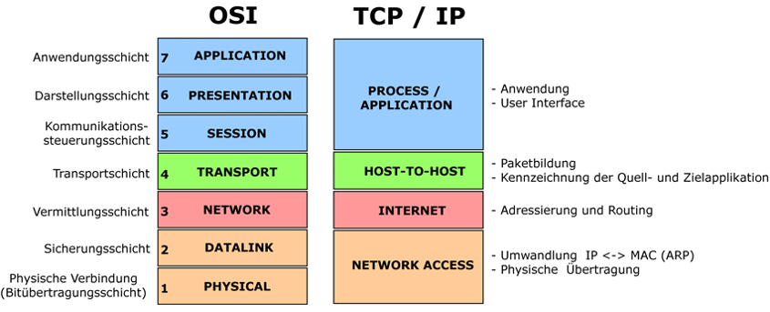

---

## 3. Layer 1 Bitübertragung (Physical)

Der Layer 1 im ISO/OSI Schichtenmodell wird als Bitübertragungsschicht oder Physical Layer bezeichnet. Wie auf den oberen Bildern gesehen stellt es die unterste Schicht des Modelles dar und definiert mechanische, physikalische und elektrische Eigenschaften dar für die Übertragung von Informationen in Bits.

Die Hauptaufgabe der Schicht 1 ist es sicherzustellen das, dass empfangende Gerät die 0 und 1 zuverlässig erkennen kann. Diese 0 und 1 werden aber nicht immer über das gleiche Medium gesendet. Da es für Layer 1 mehrere Übertragungsmedien und Optionen gibt, beispielsweise kabelgebunden oder kabellose Medien beeinflusst die oberen Layer nicht. Auch wenn die Übertragungsart austauscht.

Die Hardware auf dieser Schicht unterscheiden sich durch passiven und aktiven Komponenten. Passive Komponenten sind z. B. Stecker, Buchsen, Leitungen und Antennen. Aktive Komponenten sin z. B. Hubs, Verstärker oder Netzwerkkarte.

---

### 3.1 Twisted Pair Kabel (UTP / FTP / STP)

Bei Kupferverkabelung wird heute meistens das Twisted Pair Kabel mit vier verdrillten Adern Paaren verwendet. Twisted Pair Kabel (TB-Kabel) sind genormt und sind in Klassen und Kategorien eingeteilt, um ihre Leistungsfähigkeit zu beschreiben. In der internationalen Norm (ISO 11801) spricht man von Kategorien. Hingegen in der europäischen Norm (EN 50173) werden die Kabel in Klassen A-F eingeteilt.

In der Netzwerktechnik werden vor allem Kabel der Klasse D-F (Kategorie 5-7 Mit der Englischen Abkürzung Cat) verwendet.

Kategorien und Klassen hat man erstellt, um die Leistungsfähigkeit einer einzelnen Komponente zu beschreiben. Ausserdem ist es leichter für die Klassifizierung, damit ein Kabel einer Kategorie zugewiesen werden kann, dessen spezifischen Anforderung Profile es entspricht.  

Da die alten Bezeichnungen nicht einheitlich und verwirrend waren, wurde im Jahr 2002 ein neues Bezeichnungsschema in der Form XX/YZZ eingeführt. Mit diesen Bezeichnungen kann man die Abschirmung des Kabels, rasch erkennen.

Weshalb die Abschirmung überhaupt nötig?

Dies ist wegen des Stroms, der durch die Kabel fliest. Um die Daten vollständig von einem Gerät zu dem andern zu senden, muss das empfangende Gerät ohne Probleme die Bits 0 und 1 erkennen können, sollte jetzt aber der Strom eines anderen Kabels, das Nebenan anliegt, auch wenn nur für eine kurze Zeit rüber springen, gibt dies dann ein durcheinander. Deshalb schirmt man die Kabel ab, aber nicht nur die Kabel selbst, sondern auch die 4-Adernpaare, die sich im Kabel befinden.

**Bedeutung der Beschriftung:**

- **XX (Gesamtschirmung):**

    * U = Ungeschirmt (unshielded)
    * F = Folienschirm (foiled)
    * S = Geflechtschirm (screened)
    * SF = Geflecht- und Folienschirm

- **Y (Aderpaarschirmung):**

    * U = Ungeschirmt
    * F = Folienschirm
    * S = Geflechtschirm

- **ZZ:**

    * TP = Tweisted Pair

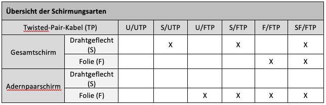

#### 3.1.1 UPD, STP, S/UTP und S/FTP

=== "UTP"

    

    Ein UTP Kabel hat keine Gesamtschirmung und ungeschirmte Paare.

=== "STP"

    

    Wenn man das STP Kabel mit dem UTP Kabel (Abbildung 3) vergleicht, sieht man, dass beim STP Kabel die Paare geschirmt sind mit einem Geflechtschirm.

=== "S/UTP"

    

    Beim S/UTP Kabel gibt es eine Gesamtschirmung (S = Geflecht).

=== "S/FTP"

    

    Hier beim S/FTP sieht man das die Paare sowohl auch die Gesamtschirmung gemacht sind.

**Beispiele:**

=== "ungeschirmt"

    

=== "geschirmt"

    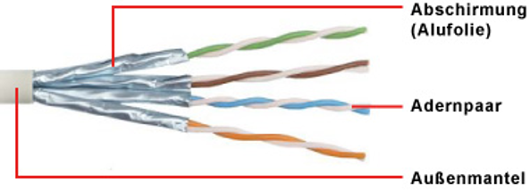

---

### 3.2 RJ45 Stecker

RJ45 ist die übliche Steckverbindung für die TB-Kabel. Einige RJ45 Stecker sind speziell entwickelt, damit sie bis Cat. 6A eingesetzt werden können. Somit kann der Stecker bis zu 10 Gigabit Ethernet verwendet werden, dafür aber nur bis zu 100 Meter. GG45- oder der Tera-Stecker sind potenziell Nachfolger für Netzte mit Cat. 7.

{: style="height:150px"}

---

### 3.3 RJ45 Stecker Belegung

TIA-568A und TIA-568B sind die zwei Standards für die Stecker Belegung bei RJ45.Beide verdrahten die Kontakte direkt durch. Das bedeutet, dass der Kontakt 1 auf der einen Seite direkt mit dem Kontakt1 auf der anderen Seite verbunden ist. Dies ist bei allen 8 gleich.$

---

### 3.4 Lichtwellenleiter

Lichtwellenleiter (Glasfaserkabel) werden heute vor allem in der primären und sekundären Verkabelung gebraucht. Glasfaserkabel sind bestens geeignet für schnelle Übertragung von grossen Datenmengen und die Kabel bieten vollständige Abschirmung gegen elektromagnetische Störungen. Da Lichtsignale über mehrere Kilometer übertragen werden können und auch weitere Distanzen erreichen als Kupferkabel gibt es einige Nachteile. Einige davon wären, dass die Glasfaserkabel teurer sind, man vorsichtiger mit ihnen umgehen muss, da sie schnell kaputtgehen können und dass auch keine Stromübertragung möglich ist.

#### 3.4.1 Fastertypen

Die Lichtwellenleiter (LWL) gibt es als Multimodefaser und Monomodfaser (Multi- und Singlemode). Wobei Multimode vor allem im Nahbereich verwendet wird (nicht wie bei Kupferkabel z. B. von Dose zu Gerät, sondern im Nahbereich von Gebäude zu Gebäude) und Singlemode kann auch im Nahbereich verwendet werden aber wird vor allem im Fernbereich benutzt.

{: style="height:450px"}

In der Multimode Faser wandern mehrere Lichtmodulationen (Photonen) gleichzeitig im Faserkern. Dies kann bei Kabellängen über 900 m zu Störungen im Kable geben.

Bei der Singlemode Faser erlaubt die reduzierte Grösse des Faserkerns jeweils nur die Übertragung von einzelnen Photonen zur selben Zeit. Durch den kleinen Kern und der Übertragung einzelnen Lichtmodulationen .

#### 3.4.2 Tabellen Übersicht Fastertypen

{: style="height:350px"}

#### 3.4.3 MM Faserklassen (GbE)

#### 3.4.4 Tabellen Übersicht Stecker Aufteilung SM/MM

---

### 3.5 LWL-Stecker

#### 3.5.1 SC-Stecker

Der subscriber connector Stecker, abgekürzt SC-Stecker wurde in Japan entwickelt und löste im Jahre 2002 den ST-Stecker aus den Normen EN50173 und ISO 11801 als Standard für LAN-Verkabelungen ab.

=== "Duplex-SC-Stecker 1"

    { align=left }

    Duplex-SC-Stecker Multimode mit sichtbaren Ferrulen.

=== "Duplex-SC-Stecker 2"

    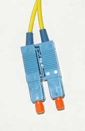{ align=left }

    Duplex-SC-Stecker Monomode mit Schutzkappen.

#### 3.5.2 LC-Stecker

Der LC-Stecker (engl. lucent connector) ist ein Small-Form-Factor-Stecker.

=== " LC-Stecker Beispiel 1"

    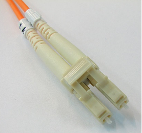

=== "LC-Stecker Beispiel 2"

    

#### 3.5.3 MTP-Stecker

Der MTP-Stecker ist ein weiterentwickelter MPO-Stecker. Bei dieser Bezeichnung handelt sich ist ein eingetragenes Warenzeichen von US Conec. Während der MPO-Stecker in Europa bekannter ist, ist es der MTP-Stecker in den USA.

=== "MTP-Stecker Beispiel 1"

    

=== "MTP-Stecker Beispiel 2"

    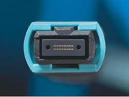

#### 3.5.4 Übersicht verschiedener Stecker

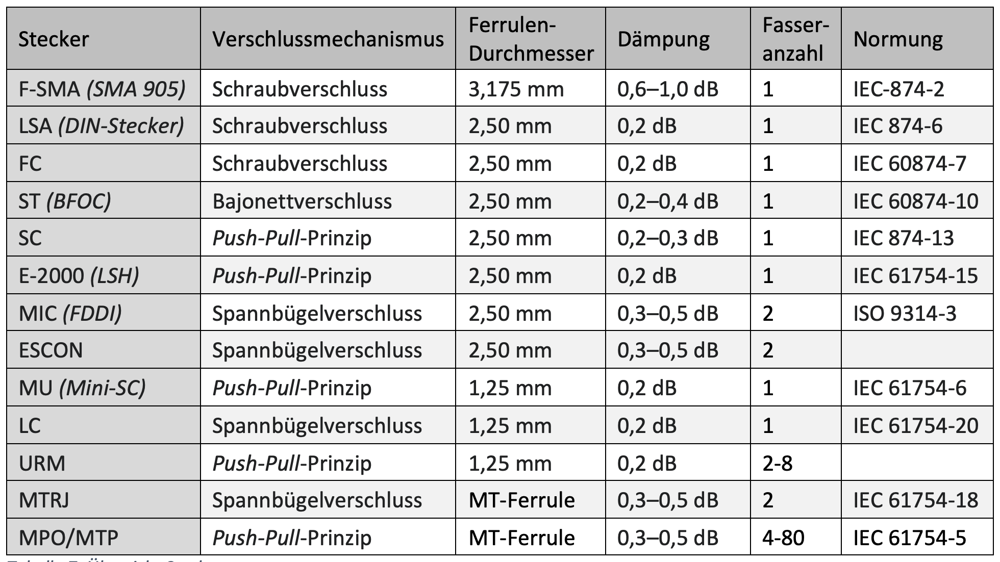{: style="height:350px"}

---

### 3.6 Fiber connector

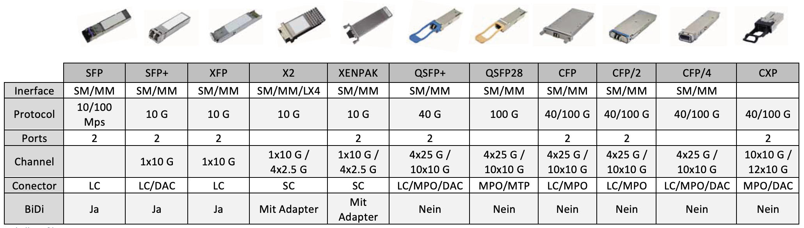

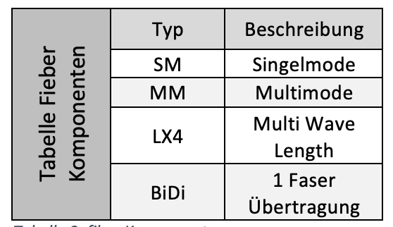{: style="height:150px"}

---

## 4. Layer 2 Sicherung (Data Link)

Die Sicherungsschicht oder auch Data Link Layer genannt ermöglicht, dass zwei Systeme, Daten in Form von Bitfolgen zuverlässig auf einem Übertragungsabschnitt austauschen können und dies ohne eine Überlastung der Strecke.
Der Zugriff auf das Übertragungsmedium regelt die Schicht 2, damit eingeschlossen ist das anzuwendende Zugriffsverfahren und die Adressierung. Aber die Voraussetzung, damit die Layer 2 diese Aufgabe erfüllen kann, wie auch die Fehlerkorrektur oder die Flusskontrolle, ist die Aufteilung des Bitstroms aus der Layer 1 in Frames.

---

### 4.1 Ethernet

Ethernet ist der Standard in Datennetzwerken. Es wurde in den 1970er Jahren entwickelt und seither ein wenig erweitert, das Frameformat von 1980 gilt aber weiterhin. Das Institute of Electrical and Electronics Engineers (IEEE) legt in den Standards der 802.3 Reihe die vielen verschiedenen Ausprägungen der Ethernet Standards fest. Mit Ethernet macht das Austauschen von Daten im Netzwerk möglich.

---

### 4.2 Zugriffsverfahren

CSMA/CD aus geschrieben für Carrier Sense Multiple Access with Collision Detecion. Ist ein Zugriffsverfahren von Ethernet, bei dem mehrere im gleichen Netzwerk auf das Übertragungsmedium zugreifen können.

**Besser Beschrieben:**

- **Carrier Sense** (Träger-Zustandserkennung): Jede Station prüft, ob das Übertragungsmedium frei ist.

- **Multiple Access** (Mehrfachzugriff): Mehrere Stationen teilen sich das Übertragungsmedium.

- **Collision Detection** (Kollisionserkennung): Wenn mehrere Stationen gleichzeitig senden, erkennen sie die Kollision.

Ethernet verwendet die Methode Carrier Sense Multiple Access/Collision Detection. Aber wie funktionier CSMA/DC eigentlich?

Damit können die Geräte die Signalträgerleitung abwechselnd verwenden. Ist ein Gerät bereit zur Übertragung, dann prüft es das Signalniveau der Leitung. So findet es heraus, ob die Leitung bereits benutzt wird oder nicht. Sollte es bereit in Benutzung sein, wartet das Gerät und versucht es zu einem späteren Zeitpunkt noch einmal (Dieser Zeitpunkt kann in diesem Fall auch nur einige Sekunden sein). Ist die Leitung frei, überträgt das Gerät sofort. Zwei Geräte können allerdings auch hier gleichzeitig Daten senden. Sollte das der Fall sein, kommt es zu einer Kollision. Kurz gesagt, jedes Gerät wartet also, bis eine Leitung frei ist, um zu Übertragen nach dem Prinzip (Listen-bevor-Talk) und bei Leitungen, die in Benutzung sind, probiert es in zufälligen Zeitspannen so lange, bis die Leitung frei ist.

---

### 4.3 Kollisionen

In einem Ethernet-Netzwerk mit Half Duplex kommt eine Kollision zustande, wenn zwei Geräte im gleichen Netzwerk versuchen, Daten zur gleichen Zeit zu übertragen. Also sind Kollisionen im Grunde nur Störungen. Diese sind nicht allzu schlimm, da die Geräte nach einer Erkennung einer Kollision ihre Daten wieder übermittelten. Sollte es aber mehrfach und andauernd zu mehreren Kollisionen kommen, könnte dies zu einem Problem werden. Die Anzahl auf mögliche Kollisionen steigt bei der Anzahl Geräte, die das gleiche Übertragungsmedium brauchen wollen.

Weshalb die möglichen Kollisionen steigen bei der Anzahl Geräte ist, weil diese zwar die Leitungen prüfen aber durch lange Leitungen und andere Sachen könnte es sein das mehrere Geräte verschiedenen Signal Laufzeiten wahrnehmen. Dies kann dazu Führern das Ein Gerät nach der Überprüfung einer freien Leitung ihr Signal sendet, obwohl das Signal eines anderen Geräts schon unterwegs ist. Solange die Bandbreite von Ethernet nicht mehr als 30% ausgereizt wird, machen sich Kollisionen kaum bemerkbar. Mit steigender Belastung des Netzwerks nehmen aber auch die Kollisionen zu. Hier hilft nur, die Anzahl der Stationen zu reduzieren oder das gesamte Netzwerk in Teilnetz aufzuteilen.

Wie oben schon kurz erwähnt gibt Ethernet-Netzwerke mit Halbduplex aber auch Vollduplex. Halbduplex-Ethernet basiert auf dem CSMA/CD-Verfahren. Es handelt sich dabei um das ursprüngliche Ethernet bis 10 MBit/s. Vollduplex-Ethernet ist eine Weiterentwicklung, die als Fast- Ethernet bezeichnet wird und auf CSMA/CD verzichtet. Auch alle weiteren Ethernet-Entwicklungen arbeiten im Vollduplex-Betrieb. Die Stationen kommunizieren über Punkt-zu-Punkt-Verbindungen direkt miteinander.

Weil Fast-Ethernet in der Regel im Vollduplex-Modus arbeitet und damit auf CSMA/CD verzichtet, ist eine zusätzliche Flusskontrolle erforderlich. Dafür gibt es einen eigenen Standard: IEEE 802.3x (Flow Control).

---

### 4.4 Frame

In einem Ethernet-Netzwerk teilen Geräte untereinander Datenpakete, die auch Ethernet-Pakete genannt werden. In dem ist auch das Ethernet-Frame (Deutsch oft als Datenframe bezeichnet). Diese Datensätze bestehen aus Binärcode, die wichtigen Informationen weiter gibt wie Adressen, Steuerinformationen, Nutzdaten und Prüfsummen.

Da es mehrere Ethernet-Standarte gibt, gibt es auch unterschiedliche aufgebaute Ethernet Frames. Die grundsätzlich gleich aufgebaut sind aber trotzdem einige Abweichungen voneinander haben die zum Beispiel abhängig vom Netzwerkprotokoll sind.

**Ethernet IEEE 802.3**

=== "Ohne Tag"

    

=== "Mit Tag"

    

    In der Abbildung sieht man, dass sich zwischen der Quellad. und Länge ein Tag vorhanden ist. Das Tag Feld enthält wichtige Informationen über die VLAN Einbindung.

#### 4.4.1 Frame Bausteine

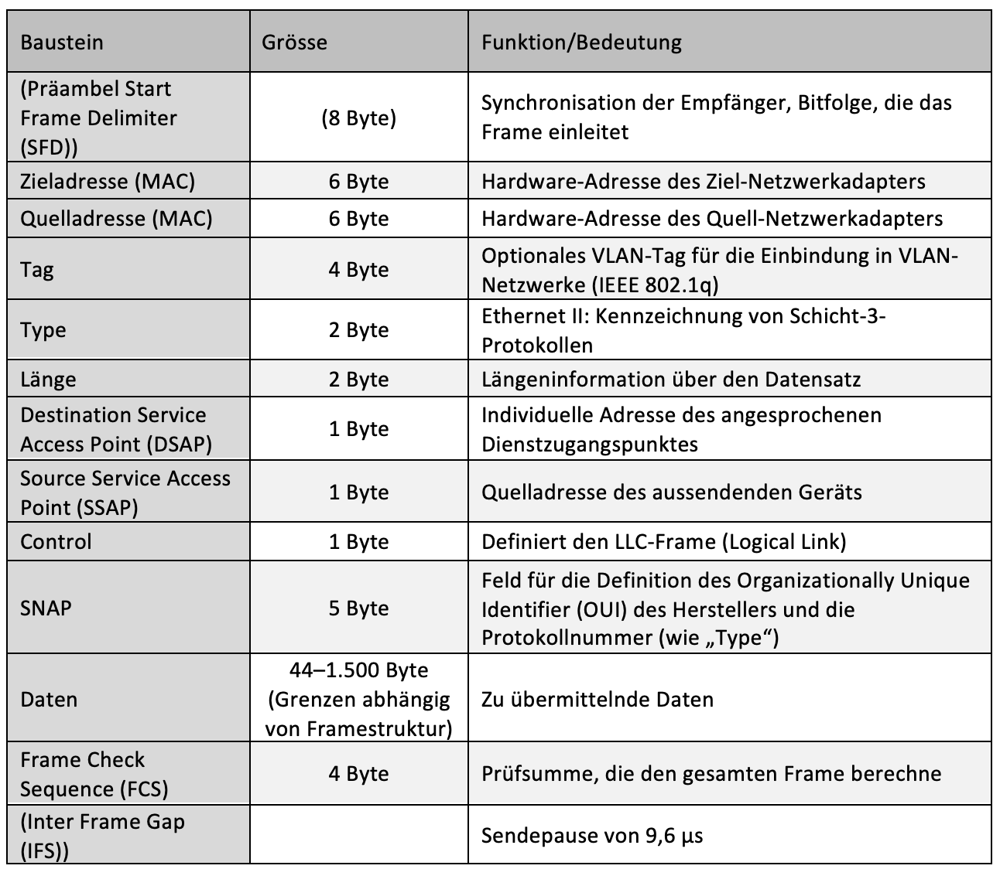{: style="height:500px"}

#### 4.4.2 Ethernet-Paket Struktur

Ein Datenpaket auf der Leitung und der Frame als Nutzdaten bestehen aus Binärdaten. Ethernet überträgt Daten mit dem höchstwertigen Oktett (Byte) zuerst, innerhalb jedes Oktetts wird jedoch das niedrigste wertige Bit zuerst übertragen.

Der interne Aufbau eines Ethernet-Frames ist in IEEE 802.3 spezifiziert. Die folgende Tabelle zeigt das komplette Ethernet-Paket.

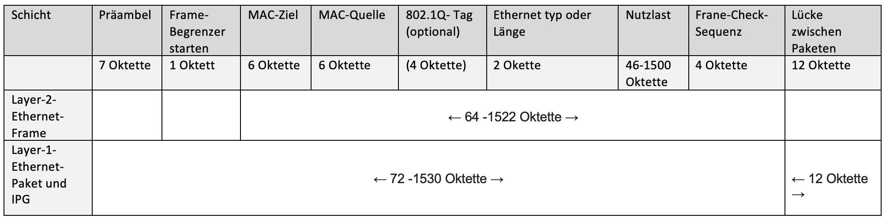

---

### 4.5 Tag im Ethernet Frame

Im 802.1 Q-Standard sind Datenfelder für das VLAN-Tagging definiert, die im Ethernet Paket im Datenberiech eingeführt werden. Das Tag besteht aus vier Feldern welche zusammen 32 Bit beträgt. Für den Tag Protocol Identifier (TPID) werden zwei Byte, für den Priority Code Point (PCP) drei Bit, für den Drop Eligible Indicator (DEI) ein Bit und für die VLAN-ID (VID) zwölf Bit genutzt.

Das TPID-Datenfeld wird bei 802.1Q-VLANs immer auf den Wert {==81 00==} hex gesetzt, dieser Wert ist reserviert.

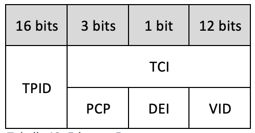{: style="height:100px"}

-	**TPID** = Tag Protocol Identifier
-	**TCI** = Tag Control Information
-	**PCP** = Priority Code Point
-	**DEI** = Drop Eligible Indicator
-	**VID** = VLAN-Identifier

**Beschreibung:**

**TPID** (Tag Protocol Identifier):
Ein 16-Bit-Feld, das auf einen Wert von 0x8100 gesetzt ist, um den Frame als einen Frame mit IEEE 802.1Q-Tag zu identifizieren. Dieses Feld befindet sich in ungetaggten Frames an derselben Position wie das EtherType-Feld und wird daher verwendet, um den Frame von ungetaggten Frames zu unterscheiden

**TCI** (Tag Control Information):
Ein 16-Bit-Feld mit PCP, DIE und VID als Unterfeldern.

**PCP** (Priority Code Point):
Das PCP-Datenfeld umfasst drei Bits, die die Frame-Priorität kennzeichnen.

**DEI** (Drop Eligible Indicator):
Das 1 Bit grosse DEI Feld, früher noch CFI. Kann separat oder in Verbindung mit PCP verwendet werden, um Rahmen anzuzeigen, die bei Vorliegen einer Überlastung fallengelassen werden können

**VID** (VLAN-Identifier):
Ein 12-Bit-Feld, das das VLAN angibt, zu dem der Frame gehört. Die Werte 0 und 4095 (0x000 und 0xFFF in hex) sind reserviert. Alle anderen Werte können als VLAN-Identifier verwendet werden, wodurch bis zu 4.094 VLANs möglich sind. Der reservierte Wert 0x000 zeigt an, dass der Frame keine VLAN-ID trägt; in diesem Fall spezifiziert das 802.1Q-Tag nur eine Priorität (in PCP- und DEI-Feldern) und wird als Prioritäts-Tag bezeichnet.

Diese Tags werden gemacht um zwischen den VLANs zu unterscheiden. Jedem VLAN wird eine eindeutige Nummer zugeteilt (VLAN-ID). Dadurch kann dann ein Gerät das zum VLAN mit der ID=4 gehört mit allen anderen Geräten im gleichen VLAN kommunizieren. Jedoch nicht mit Geräten die sich im VLAN mit der ID= 5 oder 6 befinden. Insgesamt sind 4096 – 2 VLANs möglich.

---

### 4.6 Link Aggregation

Link Aggregation ist ein Standard zur parallelen Bündelung von mehreren Netzwerkverbindungen. Vorteile einer Link Aggregation gegenüber einer Verbindung über ein einzelnes Kabel ist die höhere Übertragungsgeschwindigkeit wie auch die Ausfahlsicherheit.

{: style="height:250px"}

**Was ist LAG und wie funktioniert es?**

LAG ist eine aktuelle Technik. Eine Link Aggregation Group bildet sich, wenn wir mehrere Ports parallel zwischen zwei Switches schalten und als LAG konfigurieren. LAG baut mehrere Verbindungen zwischen zwei Switches auf, wodurch die Bandbreite erweitert wird.
Es bietet Redundanz auf Verbindungsebene bei Netzwerkfehlern und Verkehr. Auch wenn eine Verbindung ausfällt, werden die übrigen Verbindungen zwischen den beiden Switches weiterhin gehen. Sie übernehmen auch den Verkehr, der über den nicht funktionierenden laufen soll, damit Datenpakete nicht verloren gehen.

**Wo befindet sich der Link Aggregation?**

Innerhalb des Data Link Layers (Sicherungsschicht) implementiert, konkret zwischen dem MAC Client und MAC Sublayern.

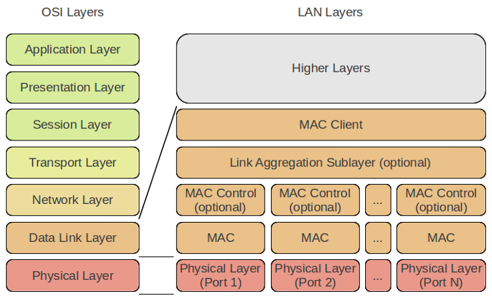{: style="height:350px"}

**Static Link Aggregation**

Bei der statischen Link Aggregation werden alle Konfigurationsparameter einmalig auf beiden beteiligten Komponenten einer LAG eingerichtet.

**Dynamic Link Aggregation - Link Aggregation Control Protocol (LACP)**

Das Link Aggregation Control Protocol (LACP) erlaubt den Austausch von Informationen bezüglich der Link Aggregation zwischen den zwei Mitgliedern einer Link Aggregation. Diese Informationen werden in LACPDUs (Link Aggregation Control Protocol Data Units) verpackt.

Bei LACP kann jeder einzelne Port als **Active LACP** oder **Passive LACP** konfiguriert werden:

=== "Passive LACP"

    Der Port bevorzugt von sich aus keine LACPDUs zu übertragen. Nur wenn die Gegenseite Active LACP hat, überträgt der Port LACPDUs (preference not to speak unless spoken to).

=== "Active LACP"

    Der Port bevorzugt LACPDUs zu übertragen. Unabhängig davon, ob die Gegenseite Passive LACP hat oder nicht.

---

## 5. Layer 3 Vermittlung (Network)

Die Layer 3 im ISO/OSI-Schichtenmodell ist für die Vermittlung der Daten über die einzelnen Verbindungsabschnitte zuständig. Sie kümmert sich um die Adressierung und das Finden des schnellsten Wegs zum Ziel. Andere Bezeichnungen für die Layer 3 sind Vermittlungsschicht, Netzwerkschicht oder Network Layer.
Im TCP/IP nennt sich die Wegfindung durch das IP-Netz, Routing. Das Routing kann statisch wie auch dynamisch definiert sein.
In den einzelnen Routern zwischen der Quelle und dem Ziel werden die Informationen der Layer 3 wie beispielsweise das Ziel und die Absende Adresse ausgewertet und für das Routing verwendet. Hierfür stellt die Network Layer ein eindeutiges Adresskonzept zur Verfügung.

---

### 5.1 IPv4-Adressierung

Die wichtigste Aufgabe von IP (Internet Protocol) ist, dass jeder Host in einem dezentralen TCP/IP-Netzwerk gefunden werden kann. Dazu wird jedem Hardware-Interface (Netzwerkkarte oder -adapter) eine logische IPv4-Adresse zugeteilt.
Die IPv4-Adresse ist mit den Angaben zu Straße, Hausnummer und Ort vergleichbar.

#### 5.1.1 Aufbau einer IPv4-Adressierung

Damit die IPv4-Adresse von Hardware und Software einfach verarbeitet werden kann, besteht sie aus einer Bitfolge aus Einsen (1) und Nullen (0). Sie ist somit maschinenlesbar. Die Bitfolge hat 32 Stellen (4 Byte (32 Bit) groß).

{: style="height:100px"}

32 Bit werden in einer IPv4-Adresse in jeweils 8 Bit (1 Byte) aufgeteilt und durch einen Punkt voneinander getrennt. Dabei kann jedes Byte durch die achtstellige 1er- und 0er-Folge einen dezimalen Wert von 0 bis 255 annehmen. Somit ergibt die binäre IPv4-Adresse 01111111.00000000.00000000.00000001 die IPv4-Adresse 127.0.0.1.
Neben der üblichen Binär und Dezimal Schreibweise können die Ipv4-Adressen auch mit Oktal zahlen und hexadezimal Zahlen angegeben werden.

#### 5.1.2 Struktur im IPv4-Adressraum

Der IPv4-Adressraum umfasst 32 Bit und geht von 0.0.0.0 bis 255.255.255.255. Das entspricht über 4 Milliarden Adressen. Als man den Adressraum definierte, entsprach das damals ungefähr der Weltbevölkerung. Damals war es undenkbar, dass jeder Mensch irgendwann mal eine IPv4-Adresse brauchen, und schon gar nicht, dass jemand ein persönliches Endgerät (Smartphone) mit einer IPv4-Adresse besitzen würde.

Man sich eine Art Verzeichnis überlegt, wo drinsteht, wo sich eine IPv4-Adresse im Netzwerk befindet. Bei Telefonnummern kennen wir die Aufteilung in Ländervorwahl und Ortsvorwahl. So eine Struktur hatte man sich auch bei IPv4-Adressen vorgestellt. Damit IP-Router möglichst effizient arbeiten können, wurden IPv4-Adressen anfangs hierarchisch zugeteilt. Das hat aber nicht sehr lange funktioniert. Wegen einem zu geringen Adressraum gilt die regionale Zuteilung, wie bei Telefonnummer, nicht mehr.

---

### 5.2 Spezielle und private Adress-Bereiche

**Privat:**

Die IPv4 Adressen sind begrenzt und müssen deswegen beantragt werden. Deshalb kann man nicht jede beliebige Adresse verwenden. Aber es gibt spezielle Adressräume für private und nicht öffentliche Nutzung.
Wenn man nun ein privates lokales Netzwerk aufbauen möchte, verwendet man solche privaten IPv4-Adressen, wenn man zu wenige oder keine öffentlichen IPv4-Adressen hat. Die privaten IPv4-Adressen haben aber den Nachteil, dass sie nur im jeweiligen lokalen Netzwerk gültig sind und nicht in öffentliches Netz geroutet werden. Datenpakete mit privaten IPv4-Adressen verbleiben in den lokalen Netzwerken. Umgekehrt heißt das auch, dass Hosts, die nur eine private IPv4-Adresse haben, nicht direkt aus dem Internet erreichbar sind.

**Spezielle:**

127.0.0.0 - 127.255.255.255 Spezielle Adressen für den eigenen Rechner (localhost).
Diese Adressen kann man im Normalfall nicht verwenden. 127.0.0.1 ist im Normalfall die eigene Loopback-Adresse
0.0.0.0 Spezielle Adresse, wird im Normalfall genutzt für die Defaultroute

---

### 5.3 Reservierte und nicht verfügbare IPv4-Adressen/Subnetze

Im Adressbereich von 0.0.0.0 bis 255.255.255.255 sind bestimmte Adressen und Subnetze für reserviert oder gesperrt. Dies ist gut zu wissen, um eine fehlerhafte IPv4-Konfiguration zu vermeiden oder zu erkennen.

**Die erste und letzte IPv4-Adresse eines Subnetzes sind reserviert**

- Die erste IPv4-Adresse eines Subnetzes adressiert das Netz und ist somit die Netz-Adresse.

- Die letzte IPv4-Adresse eines Subnetzes adressiert alle Teilnehmer in dem Netzwerk und ist somit die Broadcast-Adresse.

**Nicht routbare IPv4-Adressen**

- 0.0.0.0/8 (0.0.0.0 bis 0.255.255.255): Standard- bzw. Default-Route im Subnetz (Current Network).

- 127.0.0.0/8 (127.0.0.0 bis 127.255.255.255): Reserviert für den Local Loop bzw.Loopback.

**Private IPv4-Adressen**

-	10.0.0.0/8 (10.0.0.0 bis 10.255.255.255)

-	172.16.0.0/12 (172.16.0.0 bis 172.31.255.255)

-	192.168.0.0/16 (192.168.0.0 bis 192.168.255.255)

-	169.254.0.0/16 (169.254.0.0 bis 169.254.255.255)

**Class D (Multicast)**

-	224.0.0.0 bis 239.255.255.255: Nicht im Internet, sondern nur lokal in den eigenen Netzen routbar.

**Class E (reservierte Adressen)**

-	240.0.0.0 bis 255.255.255.255: Alte IPv4-Stacks, die nur mit Netzklassen arbeiten, kommen damit nicht klar.

---

### 5.4 Umrechnung

**DEC** = Dezimalsystem/Zehnersystem = 0 – 255

**HEX** = Hexadezimalsystem = 0,1,2,3,4,5,6,7,8,9,A,B,C,D,E,F

**BINÄR** = Binärsystem = 0,1

**OCT** = Oktalsystem = 0,1,2,3,4,5,6,7

**Dec zu Binär**

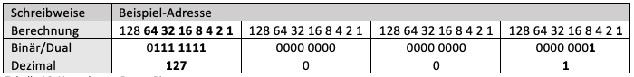

Wie man in der Tabelle sieht, muss man sich vorstellen, dass die Bit Folge von 8 Nullen für die Zahlen 128 – 1 stehen. Muss man dann die Zahl 127 in Binär umrechnen, startet man auf der rechten Seite und ersetzt die Null mit einer Eins. Dies macht man bis, die Zahlen, die mit einer Eins angegeben wurden, zusammen gezählt die Dezimal zahl ergibt, die man angeben möchte.

**Beispiele:**

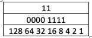

Doch die Zahlenfolge von Hex und Oct sieht anders aus.

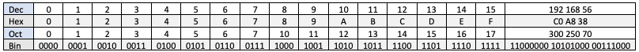

---

### 5.5 Übersicht Standards

---

### 5.6 Subnetting

Subnetting ist eigentlich die Aufteilung eines Adressraumes in mehrere kleine Adressräume. Durch Subnetting können Netze voneinander abgeschottet werden und private IP-Adressen können dann doppelt vergeben. Solange dies nicht im gleichen Adressraum geschieht.

#### 5.6.1 Subnetzmaske

Die Subnetzmaske bestimmt den Netzanteil (Subnetz) und den übergebliebenen Hostanteil einer IP-Adresse. Die Subnetzmaske zeigt also an, an welcher Stelle die Netz-Adresse und Host-Adresse getrennt werden. sprich wie viele Bit für den Host-Anteil übrigbleiben.
Für die Subnetzmaske gibt es zwei Schreibweisen, einmal mit Oktetten und einmal als Suffix.

**Beispiel:**

192.168.12.15 / **255.255.255.0**

192.168.12.15 / **24**

Bei der ersten Schreibweise wird IP-Adresse und Subnetzmaske hintereinandergeschrieben. Bei der zweiten Schreibweise wird statt der Subnetzmaske ein Suffix hingeschrieben. Das Suffix gibt an, wie viele 1er innerhalb der Subnetzmaske in Bit nacheinander aufgeschrieben werden. Dies bedeutet 24 entspricht 255.255.255.0.

#### 5.6.2 Netzwerkadresse berechnen

Wie bei 6.4 Subnetting Aufgaben zeige ich hier noch meine Berechnungsschritte auf.

Die IP-Adresse sowie die Netzmaske müssen in Binär dargestellt werden. Die werden dann abgeglichen und die Einer (1) die sich bei beiden an der gleichen Stelle der Bitfolge befinden, werden bei der Netzadresse übernommen. Diese muss man zu Schluss nur noch in Dez umwandeln.

**Beispiel:**

172.17.196.0 /21 = 255.255.248.0

| IP Adresse      | 1010 1100     | 0001 0001     | 1100 0100     | 0000 0000	    |
|                 |               |               |               |               |
| **Netzmaske**   | **1111 1111** | **1111 1111** | **1111 1000** | **0000 0000** |
| **Netzadresse** | **1010 1100** | **0001 0001** | **1100 0000** | **0000 0000** |

**= 172.17.192.0**

---

## 6. Praktische Arbeiten und Erfahrungen

---

### 6.1 Beschriftungssystem

Damit ich mir die Namensgebung merken kann werde ich unten ein Beispiel einer Beschriftung hinschreiben. Die Namensgebung ist nicht bei jeder Firma gleich meistens wird ein Konzept erstellt und dann wird dies auch angewendet.

**Beispiel:**	H6-W-V20.03-A10-10.038

=== "Aufteilung der Beschriftung und die Bedeutung"

    - H6 = Standort/Strasse

    - W	=	Ausrichtung

    - V	=	Verteiler

    - 20 = Stockwerk (Die Stockwerke gehen vom EG welches 00 ist in 10 Schritten aufwärts und   XXXXX  und ins UG gehen sie in
      einer schritten. Wie auf der Abbildung x)

    - 03 = Anzahl Verteiler/ Nr. des Verteilers

    - A10	=	Panel

    - 10 = Dose im Stockwerk

    - 038	=	Nr. der Dose

    - A	=	Das A gibt an, dass es um Kupferkabel handelt, wäre es ein Glasfaserkabel wird es mit //ABCD.L01, L02 oder L03 beschriftet.

=== "Auflösung des Beispiels"

    - H6 = Hochschulstrasse 6

    - W	=	Westen

    - V	=	Verteiler

    - 20 = 2 OG

    - 03 = Verteiler 3

    - A10	=	Panel

    - 10	=	Dose im 1 OG

    - 038 = Dosen Nummer 38

---

### 6.2 VLAN

Virtual Local Area Networks (VLAN) unterteilen ein bestehendes einzelnes physisches Netzwerk in mehrere logischen Netzwerke.
Untagged bedeutet, dass der komplette Port dem VLAN angehört.
Egal welches Gerät angeschlossen wird, wird automatisch im definierten VLAN landen. Untaggen macht man bei Ports die zu Endgeräten führen, da diese in der Regel tags nicht lesen können.

Tagged bedeutet, dass sich das Gerät mit dem VLAN tag melden muss, um in dem VLAN zu landen.
Damit können dann die Ports getagged werden über diese mehrere verschiedene VLAN’s gehen müssen. Damit kann man bis zu 4096 verschiedene braucht.

---

#### Start Aufgabe

=== "Ausgangslage"

    

    *Switch 1:*
    

    *Switch 2*
    

=== "Sollzustand"

    

    

???+ example "Arbeitsschritte"
     *Verbinden über Tera Term bei Switch 1:*

     **enable =** Anmeldung

     **show running-config =** zeigt die momentanen Konfigurationen an

     **erase startup-config =** löscht die momentanen Konfigurationen

     **reload =** startet den Switch neu

     **enable =** Anmeldung

     **conf t =** wechselt in den config Modus

     **vlan 100 name user =** erstellt das vlan 100 mit dem Namen user

     **untagged ethernet 1/1/1 to 1/1/24 =** untagged die Ports 1 bis 24

     **exit =** verlässt den (config-vlan-100) und geht in den config Modus

???+ abstract "Zwischenzustand"
     

     

???+ example "Arbeitsschritte"
     **vlan 200 name admin =** erstellt das vlan 200 mit dem Namen admin

     **untagged ethernet 1/1/25 to 1/1/48 =** untagged die Ports 25 bis 48

     **exit =** verlässt den (config-vlan-200) und geht in den config Modus

     **show running-config =** zeigt die momentanen Konfigurationen an

     **write me =** speichert die momentane Konfiguration

     **exit =** verlässt den config Modus

???+ abstract "Zwischenzustand"
     

     

     *Nun die gleichen Konfigurationen bei Switch 2 vornehmen. Danach das Gerät mit der IP 192.168.100.15 an Switch 1, Port 5 anhängen und Gerät mit der IP 192.168.100.16 an Switch 2, Port 11.*

???+ success "Test 1"
     **Stand:**

     

     

     **Soll:** Client 1 (IP 192.186.100.15) ist am Switch 1, VLAN 100, Port 5 angeschlossen und pingt erfolgreich Client 2. Client 2 (IP 192.186.100.16) ist am Switch 2, VLAN 100, Port 11 angeschlossen und pingt erfolgreich Client 1.

     **Ist:** Bei beiden Clients war der Zielhost nicht erreichbar.

     **Warum:** Weil bei beiden Ports über die die zwei Switches verbunden sind keine tags gemacht wurden.

     **Muss:**

     

     *Info: Damit dieser Test erfolgreich durchgeführt werden kann würde es reichen VLAN 100 zu taggen aber da VLAN 200 später auch gebraucht wird ist es im Muss schon vorhanden.*

---

#### **Arbeitsschritte um Fehler bei Test 1 zu beheben und IP Adresse zu setzen:**

???+ example "Arbeitsschritte"
     *Verbinden über Tera Term bei Switch 1:*

     **enable =** Anmeldung

     **show running-config =** zeigt die momentanen Konfigurationen an

     **conf t =** wechselt in den config Modus

     **ip address 192.168.1.10 255.255.255.0 dynamic =** setzt die IP-Adresse

     **show running-config =** zeigt die momentanen Konfigurationen an

     **write me =** speichert die momentane Konfiguration

???+ abstract "Zwischenzustand"
     

???+ example "Arbeitsschritte"
     **vlan 100 =** wechselt vom config Modus in den config-vlan-100

     **tagged ethernet 1/2/1 =** Tagged am angegebenen Port

     **exit =** verlässt den (config-vlan-100) und geht in den config Modus

     **vlan 200 =** wechselt vom config Modus in den config-vlan-200

     **tagged ethernet 1/2/1 =** Tagged am angegebenen Port

     **managment-vlan =** setzt den managment Status

     **exit =** verlässt den (config-vlan-200) und geht in den config Modus

     **write me =** speichert die momentanen Konfiguration

     **exit =** verlässt den config Modus

???+ abstract "Zwischenzustand"
     

???+ example "Arbeitsschritte"
     *Verbinden über Tera Term bei Switch 2:*

     **enable =** Anmeldung

     **show running-config =** zeigt die momentanen Konfigurationen an

     **conf t =** wechselt in den config Modus

     **ip address 192.168.1.20 255.255.255.0 dynamic =** setzt die IP Adresse

     **show running-config =** zeigt die momentanen Konfigurationen an

     **write me =** speichert die momentane Konfiguration

???+ abstract "Zwischenzustand"
     

???+ example "Arbeitsschritte"
     **vlan 100 =** wechselt vom config Modus in den config-vlan-100

     **tagged ethernet 1/2/1 =** Tagged am angegebenen Port

     **exit =** verlässt den (config-vlan-100) und geht in den config Modus

     **vlan 200 =** wechselt vom config Modus in den config-vlan-200

     **tagged ethernet 1/2/1 =** Tagged am angegebenen Port

     **managment-vlan =** setzt den managment Status

     **exit =** verlässt den (config-vlan-200) und geht in den config Modus

     **write me =** speichert die momentanen Konfiguration

     **exit =** verlässt den config Modus

???+ abstract "Zwischenzustand"
     

???+ success "Test 2"
     **Stand:**

     
     

     **Soll:** Client 1 (IP 192.186.100.15) ist am Switch 1, VLAN 100, Port 5 angeschlossen und pingt erfolgreich Client 2. Client 2 (IP 192.186.100.16) ist am Switch 2, VLAN 100, Port 11 angeschlossen und Ppngt erfolgreich Client 1.

     **Ist:** Pings wurden erfolgreich übertragen.

     **Warum:** Da wir die zwei Ports getaged haben.

---

#### **Arbeitsschritte um ein VLAN hinzuzufügen:**

=== "Ausgangslage"

    

    

=== "Sollzustand"

    

    

???+ example "Arbeitsschritte"
     *Verbinden über Tera Term bei Switch 1:*

     **enable =** Anmeldung

     **conf t =** Wechselt in den config Modus

     **vlan 300 name user_mobile =** Erstellt das vlan 300 mit dem Namen user_mobile

     **exit =** Verlässt den (config-vlan-300) und geht in den config Modus

     **vlan 200 =** Wechselt vom config Modus in den config-vlan-200

     **no untagged ethernet 1/1/25 to 1/1/47 =** Macht das untaggen von Port 25 bis 47 rückgängig und lässt somit Port 48 als einziger untagged

     **exit =** Verlässt den (config-vlan-200) und geht in den config Modus

???+ abstract "Zwischenzustand"
     

     

???+ example "Arbeitsschritte"
     **vlan 300 =** Wechselt vom config Modus in den config-vlan-300

     **untagged ethernet 1/1/25 to 1/1/47 =** untagged die Ports 25 bis 47

     **exit =** Verlässt den (config-vlan-300) und geht in den config Modus

     **show running-config =** Zeigt die momentanen Konfigurationen an

     **write me =** Speichert die momentanen Konfiguration

     **exit =** Verlässt den config Modus

???+ abstract "Zwischenzustand"
     

     

     *Nun die gleichen Konfigurationen bei Switch 2 vornehmen. Danach das Gerät mit der IP 192.168.100.15 an Switch 1, Port 48 anhängen und Gerät mit der Ip 192.168.100.16 an Switch 2, Port 48.*

???+ success "Test 3"
     **Stand:**

     

     

     **Soll:** Client 1 (IP 192.186.100.15) ist am Switch 1, VLAN 200, Port 48 angeschlossen und Pingt erfolgreich Client 2. Client 2 (IP 192.186.100.16) ist am Switch 2, VLAN 200, Port 48 angeschlossen und Pingt erfolgreich Client 1.

     **Ist:** Ping’s wurden erfolgreich übertragen.

     **Warum:**

???+ success "Test 4"
     *Vor dem Test muss Client 1 (IP 192.186.100.15) auf Switch 1, VLAN 300, Port 25 umgesteckt werden und Client 2 (IP 192.186.100.16) auf Switch 2, VLAN 300, Port 47.*

     **Stand:**

     

     

     **Soll:** Client 1 (IP 192.186.100.15) ist am Switch 1, VLAN 300, Port 25 angeschlossen und Pingt erfolgreich Client 2. Client 2 (IP 192.186.100.16) ist am Switch 2, VLAN 300, Port 47 angeschlossen und Pingt erfolgreich Client 1.

     **Ist:** Das Ping kann bei beiden nicht ausgeführt werden.

     **Warum:** Weil bei beiden Ports über die die zwei Switches verbunden sind keine tags gemacht wurden für das VLAN 300.

     **Muss:**

     

---

#### **Arbeitsschritte um Fehler bei Test 4 zu beheben:**

???+ example "Arbeitsschritte"
     *Verbinden über Tera Term bei Switch 1:*

     **enable =** Anmeldung

     **conf t =** Wechselt in den config Modus

     **vlan 300 =** Wechselt vom config Modus in den config-vlan-300

     **tagged ethernet 1/2/1 =** Tagged am angegebenen Port

     **exit =** Verlässt den (config-vlan-300) und geht in den config Modus

     **show running-config =** Zeigt die momentanen Konfigurationen an

     **write me =** Speichert die momentanen Konfiguration

     **exit =** Verlässt den config Modus

     *Nun die gleichen Konfigurationen bei Switch 2 vornehmen.*

???+ abstract "Zwischenzustand"
     

???+ success "Test 5"
     **Stand:**

     

     

     **Soll:** Client 1 (IP 192.186.100.15) ist am Switch 1, VLAN 300, Port 25 angeschlossen und Pingt erfolgreich Client 2. Client 2 (IP 192.186.100.16) ist am Switch 2, VLAN 300, Port 47 angeschlossen und Pingt erfolgreich Client 1.

     **Ist:** Ping’s wurden erfolgreich übertragen.

     **Warum:** Da Ich die zwei Port’s getaged haben.

---

### 6.3 Link Aggregation

=== "Ausgangslage"

    

=== "Sollzustand"

    

???+ example "Arbeitsschritte"
     *Verbinden über Tera Term bei Switch 1:*

     **enable =** Anmeldung

     **conf t =** Wechselt in den config Modus

     **lag switch_to_switch dynamic id 1 =** Erstellung eines LAG (namen switch_to_switch, dynamisch, id 1)

     **ports ethernet 1/2/1 to 1/2/2 =** Fügt die angegebenen Ports dem LAG hinzu

     **primary-port 1/2/1 =** Setzt den angegebenen Port als Primary Port

     **deploy =** Schaltet dies ein

     **write me =** Speichert die momentanen Konfiguration

     **exit =** Verlässt den (config-lag switch_to_switch dynamic id 1) und geht in den config Modus

     **show running-config =** Zeigt die momentanen Konfigurationen an

???+ abstract "Ausgabe"
     

!!! warning "Info"
    Nun muss man noch auf dem VLAN 100 den primary port taggen. Wichtig! Das taggen kann erst nach dem deploy machen ansonsten kommt beim deployen ein Error.

    Nun die gleichen Konfigurationen bei Switch 2 vornehmen.

???+ example "Arbeitsschritte"
     Jetzt bei beiden Switches noch den Primary Port taggen:

     **vlan 100 =** Wechselt vom config Modus in den config-vlan-100

     **tagged ethernet 1/2/1 =** Tagged am angegebenen Port

     **write me =** Speichert die momentanen Konfiguration

     **exit =** Verlässt den (config-vlan-100) und geht in den config Modus

     **show running-config =** Zeigt die momentanen Konfigurationen an

???+ abstract "Ausgabe"
     

???+ success "Test 1"
     **Stand:**

     

     **Soll:** Client 1 (IP 192.186.100.15) ist am Switch 1, VLAN 100, Port 47 angeschlossen und Pingt erfolgreich Client 2. Client 2 (IP 192.186.100.16) ist am Switch 2, VLAN 100, Port 47 angeschlossen und Pingt erfolgreich Client 1. Beim ausstecken vom Kabel am Port 1/2/1 an Switch 1 wird das Ping erfolgreich weitergeführt.

     **Ist:** Pings wurden erfolgreich übertragen. Nach einem kurzen unter Bruch beim ausstecken des Kabels wurde das Ping wieder erfolgreich ausgeführt.

     **Warum:** Dank dem Link Aggregation lief das ping dann über den 1/2/2 Port.

---

### 6.4 Subnetting Aufgaben

*Aufgabe 1*

=== "Ausgangslage"

    Adressvorgabe: 172.17.196.0/21

    Netzadresse:

    Broadcastadresse:

    Gatewayadresse (Erste Hostadresse):

    Anzahl mögliche Hosts:

    Um welche Adressart handelt es sich bei 172.17.196.0/21:

    Netz / Host / Broadcast / Gateway

=== "Lösung"

    Netzadresse: 172.17.192.0/21

    Broadcastadresse: 172.17.199.255

    Gatewayadresse (Erste Hostadresse): 172.17.192.1

    Anzahl mögliche Hosts: 2048 -2

    Um welche Adressart handelt es sich bei 172.17.196.0/21:

    Netz / **Host** / Broadcast / Gateway

*Aufgabe 2*

=== "Ausgangslage"

    Adressvorgabe: 10.128.31.159/27

    Netzadresse:

    Broadcastadresse:

    Gatewayadresse (Erste Hostadresse):

    Anzahl mögliche Hosts:

    Um welche Adressart handelt es sich bei 10.128.31.159/27:

    Netz / Host / Broadcast / Gateway

=== "Lösung"

    Netzadresse: 10.128.31.128

    Broadcastadresse: 10.128.31.159

    Gatewayadresse (Erste Hostadresse): 10.128.31.129

    Anzahl mögliche Hosts: 32 -2

    Um welche Adressart handelt es sich bei 10.128.31.159/27:

    Netz / Host / **Broadcast** / Gateway
