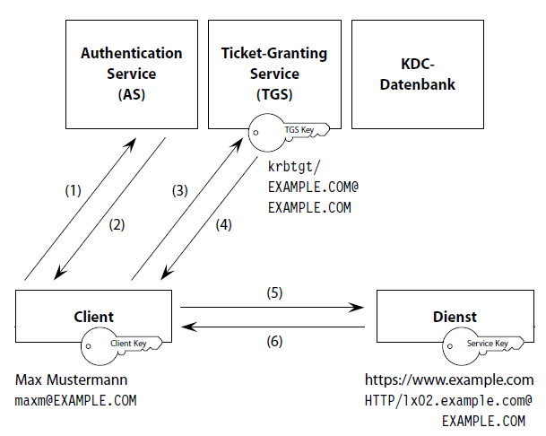

*Wochenbericht NETSEC 2022*

## **Ablauf**

!!! example ""
      <figure markdown>
        
        <figcaption>Ablauf Tabellenform
      </figure>

!!! example ""
      <figure markdown>
        {: style="height:260px"}
        <figcaption>Ablauf Grafik
      </figure>

## **Legende Schlüssel**

| Abkürzung      | Bedeutung                                   |
| -------------- | ------------------------------------------- |
| K~A~           | private Key Client                          |
| K~KDC~         | private Key KDC = Langzeitschüssel des TGS  |
| TGS_S~A,KDC~   | TGS_Session Key (Authentisierung)           |
| K~B~           | Langzeitschlüssel des Servers/ Service      |
| Service_K~A,B~ | Service-Session-Key                         |
