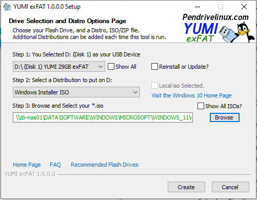

# Multiboot-USB-Stick mit YUMI erstellen

*Wochenbericht KW18*

Mit dieser Anleitung kann man einen Multiboot-USB-Stick erstellen. Ich habe dafür YUMI („Your Universal Multiboot Installer“) verwendet und ein Windows 10, Windows 11 und Knoppix 9.1 gewählt.

##  YUMI Download

1. Auf der [Pendrivelinux.com](https://www.pendrivelinux.com/yumi-multiboot-usb-creator/) findet man die drei YUMI Varianten, die man downloaden kann. Ich habe YUMI exFAT verwendet. Der direkte link für [YUMI exFAT](https://www.pendrivelinux.com/yumi-multiboot-usb-creator/#YUMI-exFAT).

    

2. Zum Downloaden, beim YUMI exFAT (BIOS and UEFI USB Boot) abschnitt bis nach unten scrollen und auf den Download Button klicken. Nach dem Download YUMI mit einem doppelklick starten.

## Multiboot-USB-Stick erste schritte

1. Nach dem Starten von YUMI muss man zuerst die Bedingungen mit «**I Agree**» bestätigen.

     

2. Nun unter **Step 1: ...** der gewünschte USB-Stick anwählen.

     

3. Jetzt bei **Step 2: ... die** Liste öffnen, in dem man ins leere Feld klickt und danach das passende zu Ihrem iso wählen. (Da ich ein Windows 11 iso auf dem Stick haben wollte, habe ich in der Liste Windows Installer iso ausgewählt)

    

4. Nun da der Explorer erschienen ist kann man zum iso File navigieren und dies anwählen. Wen man das richtige iso hat, **Öffnen** anwählen.

    

5. Jetzt kann man auf **Create** klicken.

    === "Create"    
        
        

    === "Kopierprozess"

        Der Kopierprozess dauert ca. 2 Minuten.

        

    === "Hinzufügung"

        Nachdem es fertig geladen hat, kann man auch **Next >** klicken.

        

    === "Nächstes ISO"

        Nun wird man danach gefragt, ob man ein weiteres iso auf den Stick laden möchte. Da auf einen Multiboot-USB-Stick mehrere gehören, habe ich **ja** angewählt.

        

## Weitere Images

Nach dem man Ja angewählt hat, erscheint das gleiche Feld wie zuvor. Jetzt kann man die gleichen Schritte wie zuvor durchspielen, bis man alle Images hat, die man möchte.

**Beispiel Knoppix:**

Bei Knoppix habe ich das gleiche wie bei Windows gemacht, nur dass ich bei **Step 2: ...** Ubuntu ausgewählt habe.

## Hinweise

- Sollte man zweimal das gleiche iso anwählen, wird man darauf aufmerksam gemacht.

  

- Bei mehreren ISOs erscheint ein **Step 4:...** welcher optional ist.

  

- Bei wieder Verwendung von YUMI kann man unter **Reinstall or Update?** nachschauen welche die aktuellste Version ist und welche Version auf dem Gerät installiert ist.

  
