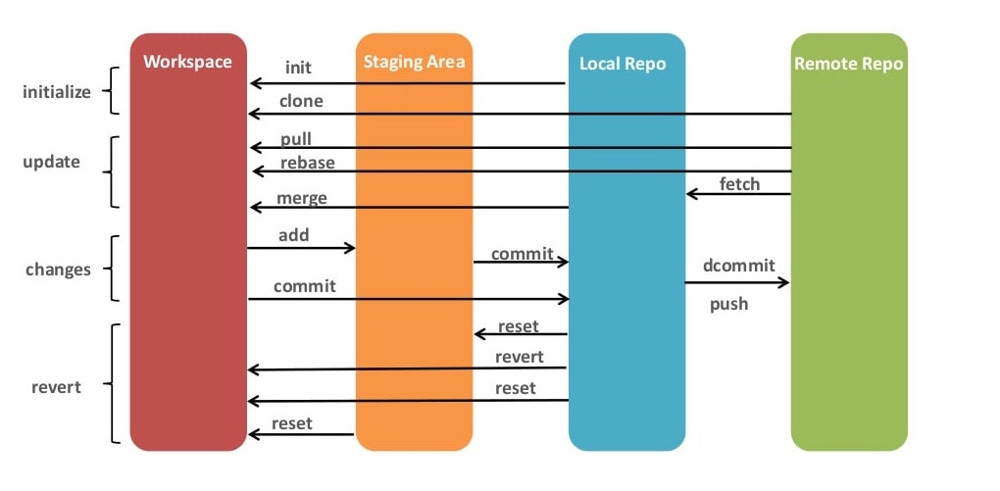

*Wochenbericht KW34*



### Repository Management

???+ example "Befehle"
     Instaliert ein lokales Repository:

     ```bash
     git init
     ```

     Zeigt die Namen der entfernent Repositorys an, die mit dem lokalen Klon verbunden sind:

     ```bash
     git remote
     ```

     Wie oben, zeigt zusätzlich die URLs an, die das lokale Repository für Abrufe und Push-Vorgänge verwendet:

     ```bash
     git remote -v
     ```

     Kann vverwendet werden, um eine Vebbindung zwischen dem lokalen und einem entfernten Repository herzustellen:

     ```bash
     git remote add remote-name remote-url
     ```

     Erstelt einen lokalen Klon eines entfernten Repositors:

     ```bash
     git clone remote-url local-subfolder-name
     ```

     Überträgt die alle Commits, die im entfernten Repository noch nicht vorhanden sind:

     ```bash
     git push remote-name branch-name
     ```

     +Holt die lokal noch fehlenden Commits in den lokalen Klon:

     ```bash
     git pull remote-name branch-name
     ```

     Falls lokal bereits neuere Commits vorhanden sind, wird der obige Befehl verweigert. Mit folgendem Befehl können die neuen Commits entfernt, ein Pull durchgeführt und die Commits wieder angehähngt werden:

     ```bash
     git pull --rebase remote-name branch-name
     ```

     Trennt die Verbindung zwischen dem lokalen Klon und ein entferten Repositorydas lokale Repository voanhand des angegebenen Namens:

     ```bash
     git remote rm remote-name
     ```

### Commmits verwalten

???+ example "Befehle"
     Zeigt der aktuellen Stand auf dem aktuellen Branch im Vergleich zum letzte Commit an, d.h. zwischen "Local Repo" und "Workspace" sowie der "Staging Area":

     ```bash
     git status
     ```

     Zeigt Änderungen im lokalen Klon, abhängig davon, wie der Befehl aufgerufen wird:

     ```bash
     # Zeigt Änderungen zwischen "Workspace" und "Local Repo" (geändert, erstellt, aber noch nicht mit add in der Staging Area vorbereitet)
     git diff
     # Zeigt Änderungen, die "geadded/gestaged" sind, sprich für das nächste Commit bereitgemacht:
     git diff --staged
     # Zeigt alle lokalen Änderungen im Vergleich zum HEAD == letzten Commit, also die Summe der beiden obigen Befehle:
     git diff HEAD
     ```

     Fügt alle lokalen Änderungen im angegebenen File hinzu:

     ```bash
     git add filename
     ```

     Fügt alle Änderungen im "Workspace" in die "Staging Area":

     ```bash
     git add .
     ```

     Erstellt aus allen Änderungen in der "Staging Area" ein neues Coomit im "Local Repo":

     ```bash
     git commit -m "Mitteillung"
     ```

     Listet die letzten Commits im lokalen Repo auf:

     ```bash
     git log
     ```

     Listet die Letzten Commits in eine Graph-Ansicht auf:

     ```bash
     git log --graph --oneline
     ```

### Branch Management

???+ example "Befehle"
     Erstellt einen neuen Branch, falls dieser noch nicht existiert, und wechselt auf diesen:

     ```bash
     git checkout -b branch-name
     ```

     Löscht den angegebenden Branch lokal, sofern dieser keine Änderungen enthält, die noch nicht übernommen wurden:

     ```bash
     git branch -d branch-name
     ```

     Löscht den Branch ohne Rücksicht zu nehmen auf noch nicht übernommene Änderungen:

     ```bash
     git branch -D branch-name
     ```

     Löscht den Branch im angegebenen entferten Repository:

     ```bash
     git push remote-name :branch-name
     ```

     Führt Änderungen vom angegebenen Branch in den aktuell ausgecheckten Branch ein:

     ```bash
     git merge branch-name
     ```
