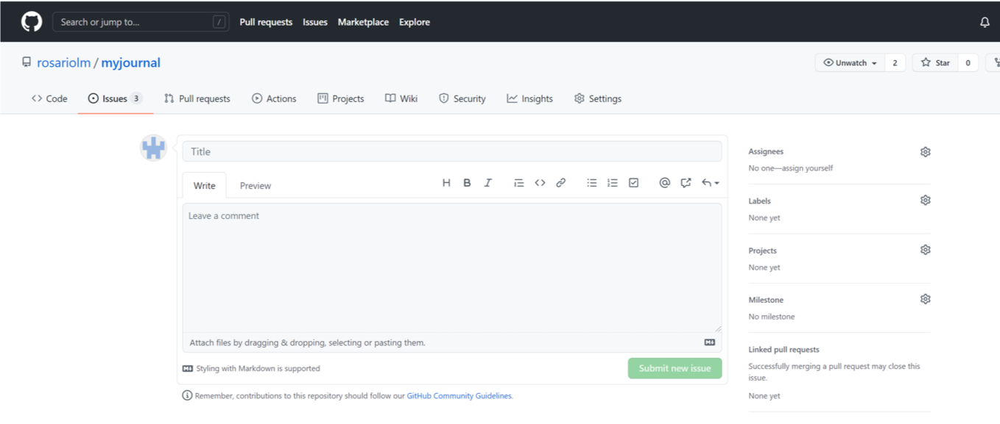

# Workflow

*Wochenbericht KW36*

1. Ticket auf github erstellen. Unter "Issue"/"New Issue"


Bei der Erstellung passender Titel wählen, Assignees und Labels setzen. Eine kurze Beschreibung, wenn möglich auch.




2. Branch Erstellen und auch direkt aud den neu erstellten branch wechseln.

```bash
git checkout -b Issue_number
```

Die ISsue number als branch name zu verwenden ist optional. Es hat den Vorteil das man bei mehreren branches den Überblick nicht verliert.


3. Bearbeitung starten. Die unten aufgelisteten befehle und shortcuts können bei der Bearbeitung behilflich sein.

Datei mit vim öffnen um die angegebene Datei zu  Bearbeiten.

```bash
vim datei_name
```

- a/A Bearbeitung starten
- :wq Abspeichern und Datei schliessen
- :w Abspeichern


4. Nach der Bearbeitung adden und commiten.

```bash
git add .
```
```bash
git commit -m "beschreibung"
```

5. Mit dem unteren befehl pushen (pull request).

```bash
git push origin branch_name
```

Angezeigter link kann nun im Browser eingegeben werden.


6. Am besten Änderungen und gemachtes beschreiben und das dazu gehörige Ticket erwähnen.


7. Der pull request anehmen.


8. Mit den zwei unteren Befehlen zurück auf den main branch wechseln und der issue branch löschen.

```bash
git checkout main
```

```bash
git branch -d branch_name
```


9. Ticket auf github schliessen.


