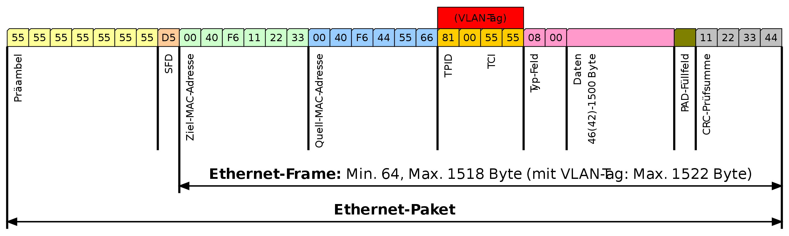

*Wochenbericht KW45*

Im 802.1 Q-Standard sind Datenfelder für das VLAN-Tagging definiert, die im Ethernet Paket im Datenberiech eingeführt werden. Das Tag besteht aus vier Feldern welche zusammen 32 Bit beträgt. Für den Tag Protocol Identifier (TPID) werden zwei Byte, für den Priority Code Point (PCP) drei Bit, für den Drop Eligible Indicator (DEI) ein Bit und für die VLAN-ID (VID) zwölf Bit genutzt.
Das TPID-Datenfeld wird bei 802.1Q-VLANs immer auf den Wert 81 00 hex gesetzt, dieser Wert ist reserviert.

**Beschreibung:**

**TPID** (Tag Protocol Identifier):
Ein 16-Bit-Feld, das auf einen Wert von 0x8100 gesetzt ist, um den Frame als einen Frame mit IEEE 802.1Q-Tag zu identifizieren. Dieses Feld befindet sich in ungetaggten Frames an derselben Position wie das EtherType-Feld und wird daher verwendet, um den Frame von ungetaggten Frames zu unterscheiden

**TCI** (Tag Control Information):
Ein 16-Bit-Feld mit PCP, DIE und VID als Unterfeldern.

**PCP** (Priority Code Point):
Das PCP-Datenfeld umfasst drei Bits, die die Frame-Priorität kennzeichnen.

**DEI** (Drop Eligible Indicator):
Das 1 Bit grosse DEI Feld, früher noch CFI. Kann separat oder in Verbindung mit PCP verwendet werden, um Rahmen anzuzeigen, die bei Vorliegen einer Überlastung fallengelassen werden können

**VID** (VLAN-Identifier):
Ein 12-Bit-Feld, das das VLAN angibt, zu dem der Frame gehört. Die Werte 0 und 4095 (0x000 und 0xFFF in hex) sind reserviert. Alle anderen Werte können als VLAN-Identifier verwendet werden, wodurch bis zu 4.094 VLANs möglich sind. Der reservierte Wert 0x000 zeigt an, dass der Frame keine VLAN-ID trägt; in diesem Fall spezifiziert das 802.1Q-Tag nur eine Priorität (in PCP- und DEI-Feldern) und wird als Prioritäts-Tag bezeichnet.

Diese Tags werden gemacht um zwischen den VLANs zu unterscheiden. Jedem VLAN wird eine eindeutige Nummer zugeteilt (VLAN-ID). Dadurch kann dann ein Gerät das zum VLAN mit der ID=4 gehört mit allen anderen Geräten im gleichen VLAN kommunizieren. Jedoch nicht mit Geräten die sich im VLAN mit der ID= 5 oder 6 befinden. Insgesamt sind 4096 – 2 VLANs möglich.
