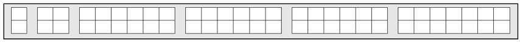
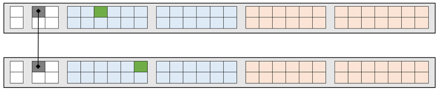
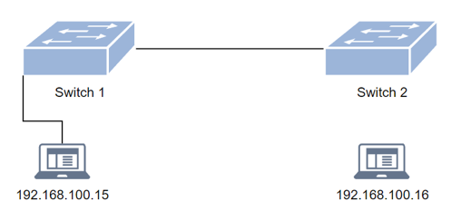
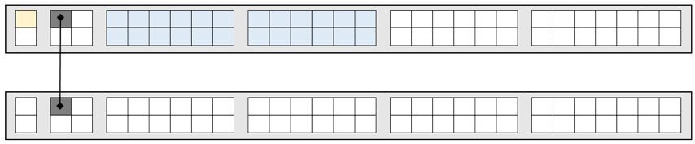
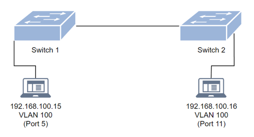
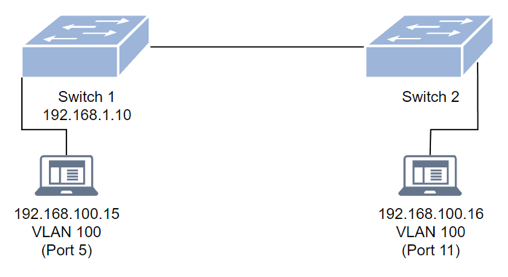
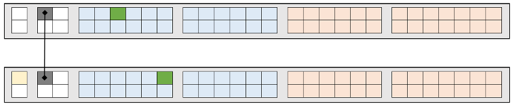

*Wochenbericht KW47*

=== "Ausgangslage"

    

    *switch 1:*

    

    *switch 2:*

    

=== "Sollzustand"

    
    

???+ example "Arbeitsschritte"
     *Verbinden über Tera Term bei Switch 1:*

     **enable =** Anmeldung

     **show running-config =** Zeigt die momentanen Konfigurationen an

     **erase startup-config =** Löscht die momentanen Konfigurationen

     **reload =** Startet den Switch neu

     *Nach dem Neustart*

     **enable =** Anmeldung

     **conf t =** Wechselt in den config Modus

     **vlan 100 name user =** Erstellt das vlan 100 mit dem Namen user

     **untagged ethernet 1/1/1 to 1/1/24 =** untagged die Ports 1 bis 24

     **exit =** Verlässt den (config-vlan-100) und geht in den config Modus

???+ abstract "Zwischenzustand 1"
     
     

???+ example "Arbeitsschritte"
     **vlan 200 name admin =** Erstellt das vlan 200 mit dem Namen admin

     **untagged ethernet 1/1/25 to 1/1/48 =** untagged die Ports 25 bis 48

     **exit =** Verlässt den (config-vlan-200) und geht in den config Modus

     **show running-config =** Zeigt die momentanen Konfigurationen an

     **write me =** Speichert die momentanen Konfiguration

     **exit =** Verlässt den config Modus

???+ abstract "Zwischenzustand 2"
     
     

!!! warning "Test Vorbereitung"
    *Nun die gleichen Konfigurationen bei Switch 2 vornehmen. Danach das Gerät mit der IP 192.168.100.15 an Switch 1, Port 5 anhängen und Gerät mit der IP 192.168.100.16 an Switch2, Port11.*

???+ success "Test 1"
     **Stand:**

     
     

     **Soll:** Client 1 (IP 192.186.100.15) ist am Switch 1, VLAN 100, Port 5 angeschlossen und Pingt erfolgreich Client 2. Client 2 (IP 192.186.100.16) ist am Switch 2, VLAN 100, Port 11 angeschlossen und Pingt erfolgreich Client 1.

     **Ist:** Bei beiden Clients war der Zielhost nicht erreichbar.

     **Warum:** Weil bei beiden Ports über die die zwei Switches verbunden sind keine tags gemacht wurden.

     **Muss:**

     

     *Damit dieser Test erfolgreich durchgeführt werden kann, würde es reichen VLAN 100 zu taggen. Aber da VLAN 200 später auch gebraucht wird, ist es im Muss schon vorhanden.*

???+ example "Arbeitsschritte"
     **Arbeitsschritte um Fehler bei Test 1 zu beheben und IP Addresse zu setzen:**

     *Verbinden über Tera Term bei Switch 1:*

     **enable =** Anmeldung

     **show running-config =** Zeigt die momentanen Konfigurationen an

     **conf t =** Wechselt in den config Modus

     **ip address 192.168.1.10 255.255.255.0 dynamic =** Setzt die IP Adresse

     **show running-config =** Zeigt die momentanen Konfigurationen an

     **write me =** Speichert die momentanen Konfiguration

???+ abstract "Zwischenzustand 3"
     

???+ example "Arbeitsschritte"
     **vlan 100 =** Wechselt vom config Modus in den config-vlan-100

     **tagged ethernet 1/2/1 =** Tagged am angegebenen Port

     **exit =** Verlässt den (config-vlan-100) und geht in den config Modus

     **vlan 200 =** Wechselt vom config Modus in den config-vlan-200

     **tagged ethernet 1/2/1 =** Tagged am angegebenen Port

     **managment-vlan =** Setzt den managment Status

     **exit =** Verlässt den (config-vlan-200) und geht in den config Modus

     **write me =** Speichert die momentanen Konfiguration

     **exit =** Verlässt den config Modus

???+ abstract "Zwischenzustand 4"
     

???+ example "Arbeitsschritte"
     *Verbinden über Tera Term bei Switch 1:*

     **enable =** Anmeldung

     **show running-config =** Zeigt die momentanen Konfigurationen an

     **conf t =** Wechselt in den config Modus

     **ip address 192.168.1.20 255.255.255.0 dynamic =** Setzt die IP Adresse

     **show running-config =** Zeigt die momentanen Konfigurationen an

     **write me =** Speichert die momentanen Konfiguration

???+ abstract "Zwischenzustand 5"
     

???+ example "Arbeitsschritte"
     **vlan 100 =** Wechselt vom config Modus in den config-vlan-100

     **tagged ethernet 1/2/1 =** Tagged am angegebenen Port

     **exit =** Verlässt den (config-vlan-100) und geht in den config Modus

     **vlan 200 =** Wechselt vom config Modus in den config-vlan-200

     **tagged ethernet 1/2/1 =** Tagged am angegebenen Port

     **managment-vlan =** Setzt den managment Status

     **exit =** Verlässt den (config-vlan-200) und geht in den config Modus

     **write me =** Speichert die momentanen Konfiguration

     **exit =** Verlässt den config Modus

???+ abstract "Zwischenzustand 6"
     

???+ success "Test 2"
     **Stand**

     
     

     **Soll:** Client 1 (IP 192.186.100.15) ist am Switch 1, VLAN 100, Port 5 angeschlossen und Pingt erfolgreich Client 2. Client 2 (IP 192.186.100.16) ist am Switch 2, VLAN 100, Port 11 angeschlossen und Pingt erfolgreich Client 1.

     **Ist:** Ping’s wurden erfolgreich übertragen.

     **Warum:** Da wir die zwei Port’a getaged haben.
