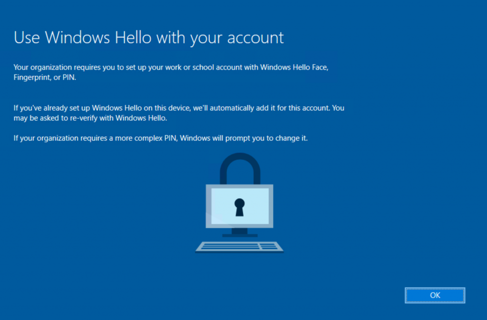
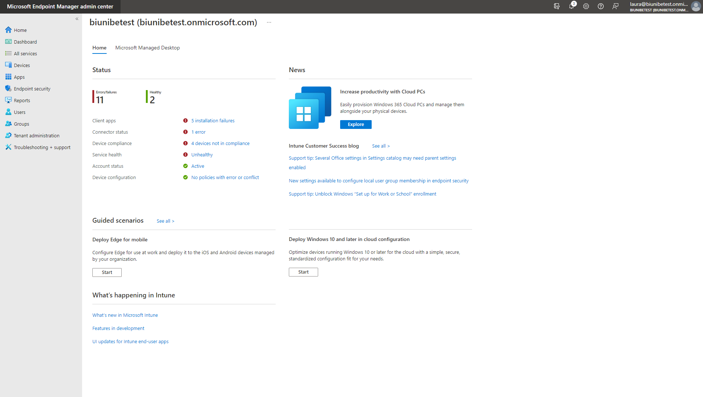
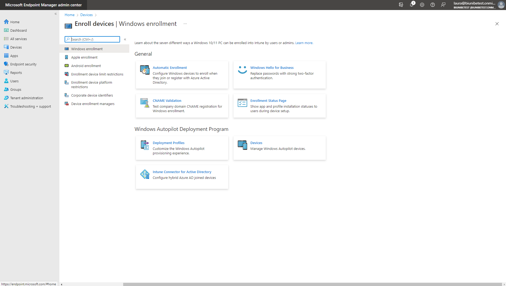
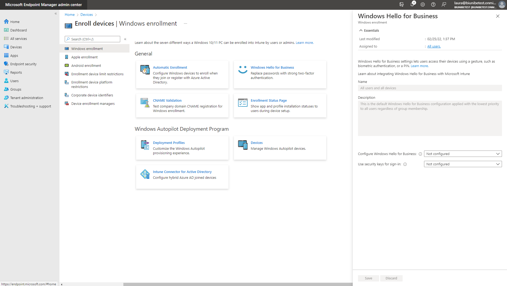
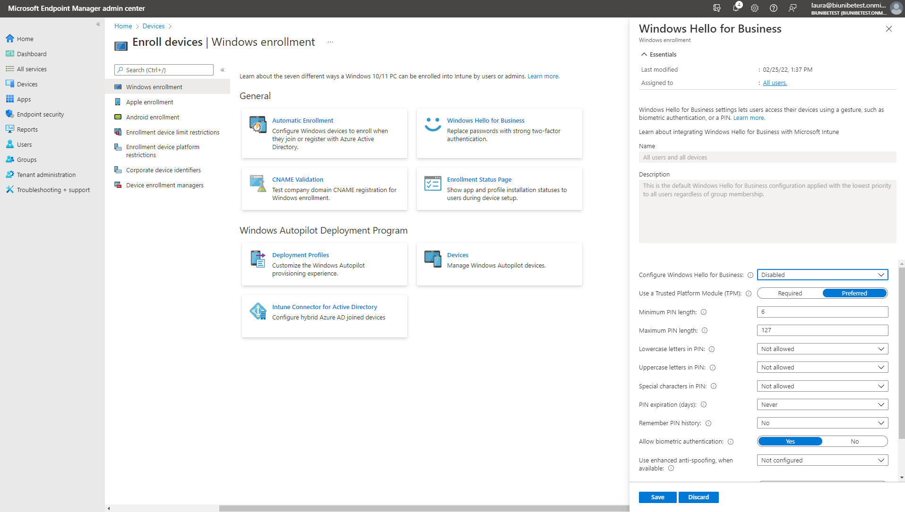
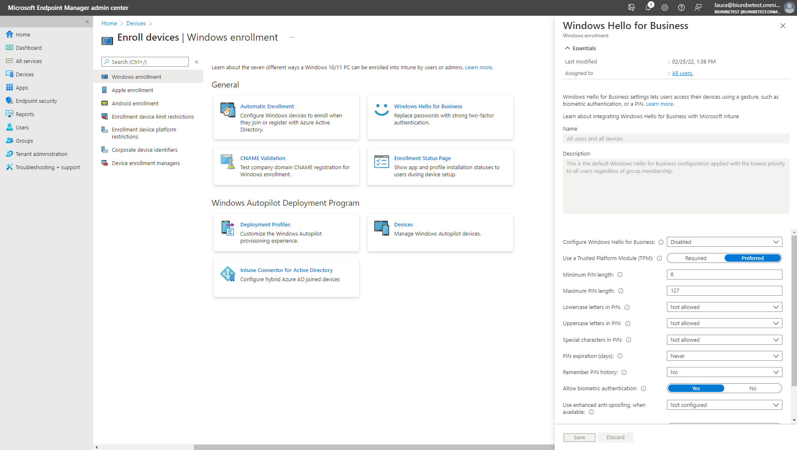

*Wochenbericht KW5*

Nach diesem kurzen Schritt wird das "Windows Hello for Business" deaktiviert. Somit auch die Eingabe vom PIN, welche ich deaktivieren wollte.

???+ example "Arbeitsschritte"
     1. Zuerst muss man vom Home aus zu **Devices > Windows > Windows enrollment** navigieren.

        

     2. Unter **Windows enrollment** kann man nun **Windows Hello for Business** anklicken.

        

     3. Auf dem neu erschienen Feld, muss man unter **Configure Windows Hello for Business** *Disabled* angeben.

        

     4. Nun *Save* anwählen.

        

     5. Nach der Speicherung wurde der PIN schon deaktiviert.

        
