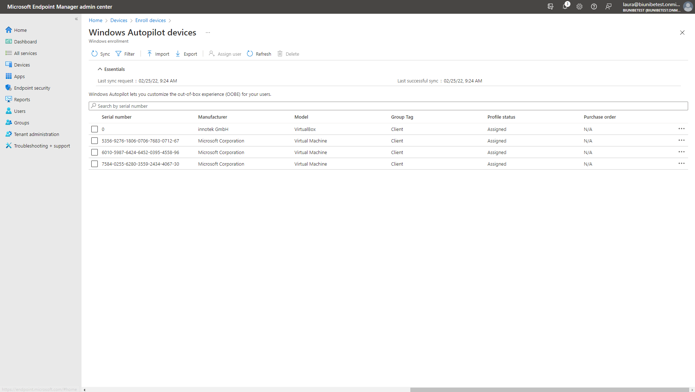
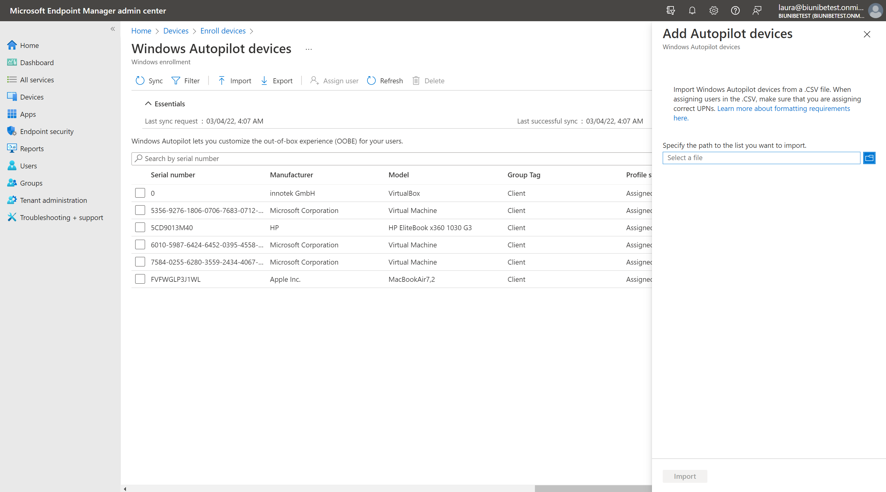
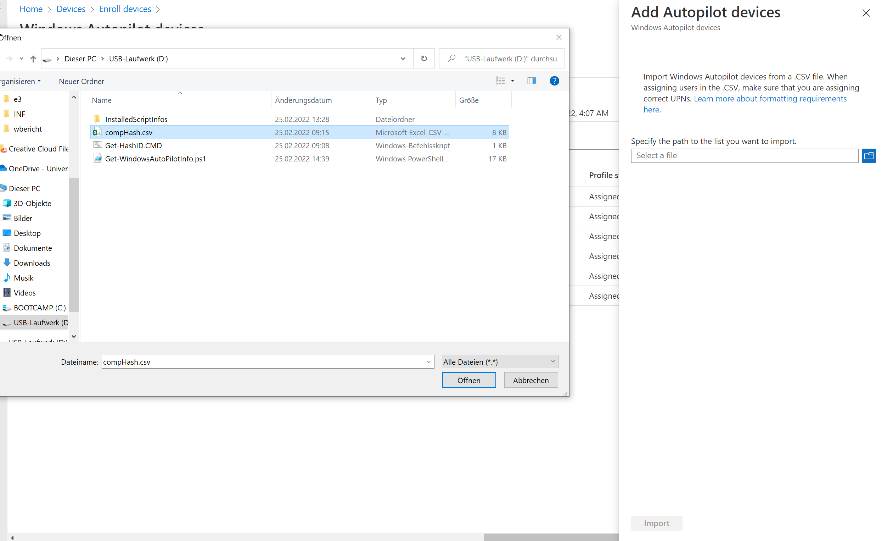

*Wochenbericht KW7*

Bevor man in Intune das Gerät importieren kann. Muss ein Script auf dem jeweiligen Gerät ausgeführt werden.

## Auf dem Gerät

1. Wie auf [THE LAZY ADMINISTRATOR](https://www.thelazyadministrator.com/2020/01/27/get-a-new-computers-auto-pilot-hash-without-going-through-the-out-of-box-experience-oobe/) das Script herunterladen und am besten auf einem USB-Stick speichern, für weiteren gebrauch.

2. Nach dem Download fehlte bei mir noch ein CMD feil welches ich kopiert habe.

3. Nun kann das Get-WindowsAutoPilotInfo.ps1 ausgeführt werden. *Als Admin ausführen!*

4. Nun sollte eine compHas.csv erstanden sein, welche man für den Intune schritt braucht.

## In Intune

1. Zuerst muss man vom Home aus zu **Devices > Windows > Windows enrollment > Devices** navigieren.

     

2. Auf der **Windows Autopilot devices** Seite *Import* anwählen.

     

3. Hier nun die erstellte compHash.csv angeben.

     === "Schritt 1"

          {: style="height:550px"}

     === "Schritt 2"

          

     === "Schritt 3"

          {: style="height:550px"}

4. Nach einigen Minuten sollte das Gerät neu auf der Liste erscheinen.

     
