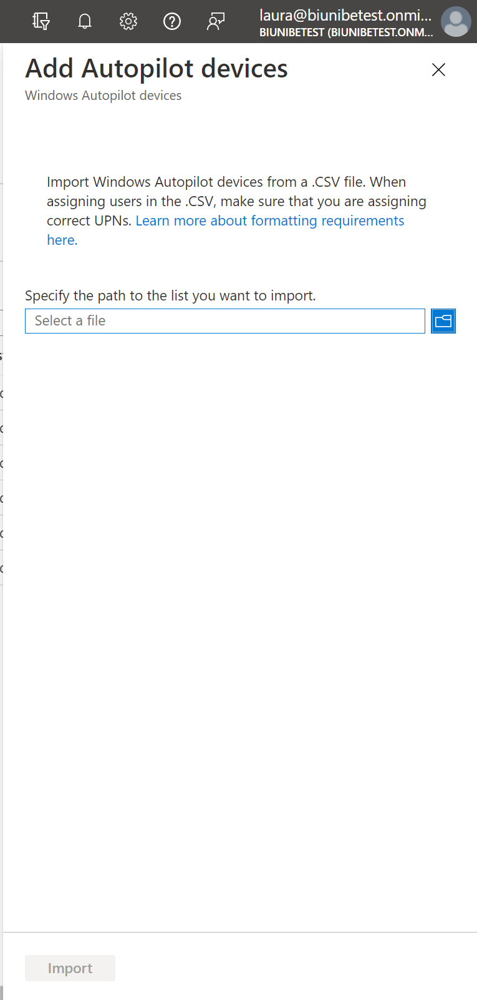
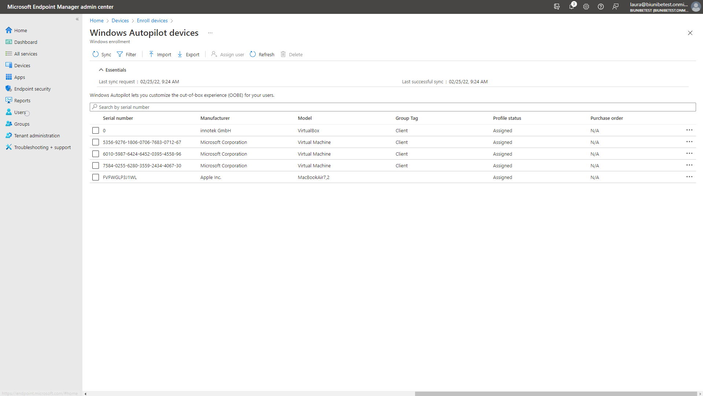

*Wochenbericht KW7*

Bevor man in Intune das Gerät importieren kann. Muss ein Script auf dem jeweiligen Gerät ausgeführt werden.

???+ example "Arbeitsschritte auf dem Gerät"
     1. Auf x das Script herunterladen und am besten auf USB-Stick speichern für weiteren gebrauch.

     2. Nach dem Download fehlte bei mir noch ein CMD feil welches ich von x  kopiert habe.

     3. Nun kann das Get-WindowsAutoPilotInfo.ps1 ausgeführt werden. *Als Admin ausführen!*

     4. Nun sollte eine compHas.csv erstanden sein, welche man für den Intune schritt braucht.

        

???+ example "Arbeitsschritte in Intune"
     1. Zuerst muss man vom Home aus zu **Devices > Windows > Windows enrollment > Devices** navigieren.

        

     2. Auf der **Windows Autopilot devices** Seite *Import* anwählen.

        

     3. Hier nun die erstellte compHash.csv angeben.

        

     4. Nach einigen Minuten sollte das Gerät neu auf der Liste erscheinen.

        
