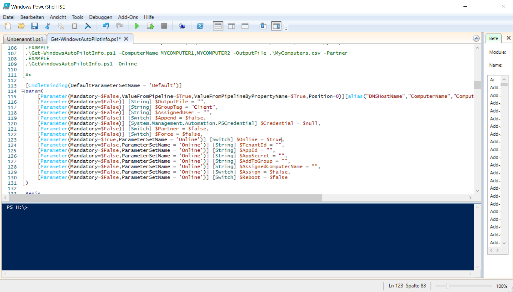

*Wochenbericht KW8*

Damit das Gerät welches mit Autopilot aufgesetzt wird, auch den Group Tag erhält und Online die neuste Windows Version herunterlädt. Muss man nur drei kleine Änderungen am Script vornehmen, welches im KW7 Wochenbericht erstellt habe.

##Arbeitsschritte

### 1. Zum Starten Windows PowerShell ISE öffnen.

### 2. Nun die Script Datei auf dem USB-Stick öffnen.

=== "Schritt 1"

     Von der Startseite aus zu **Datei > Öffnen...** navigieren. Oder mit dem shortcut Strg + O.

     

=== "Schritt 2"

     Jetzt zur ps1. Datei navigieren und diese öffnen.

     

### 3. Nun die drei Änderungen vornehmen.

=== "Unverändert"

    

=== "Group Tag"

     Da ich möchte, dass jedes Gerät den Group Tag Client automatisch zugeordnet kriegt. Gebe ich dies unter $GroupTag an. 
     Auf dem Bild wäre dies in der Zeile 117 zusehen.

     
     
=== "Online"

     Jetzt noch $Online auf $true stellen.
     Auf dem Bild wäre dies in der Zeile 123 zusehen.

      

=== "Assign"

     Assign habe ich zusätzlich auch noch auf $true gestellt.
     Auf dem Bild wäre dies in der Zeile 129 zusehen.

     
